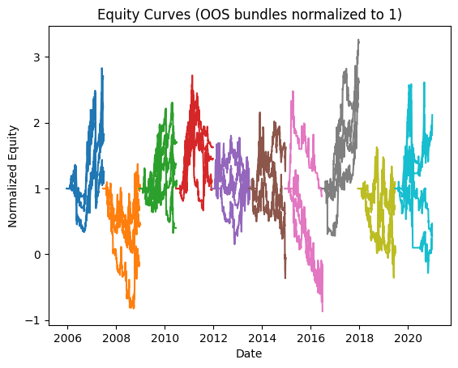
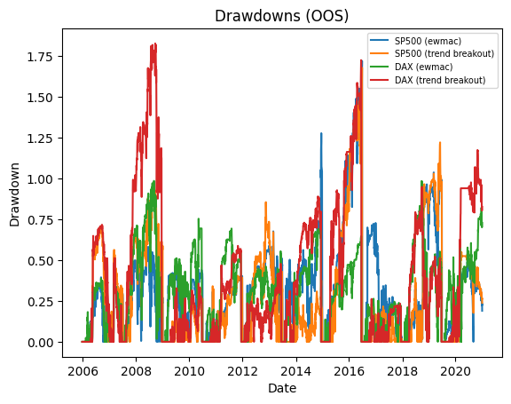
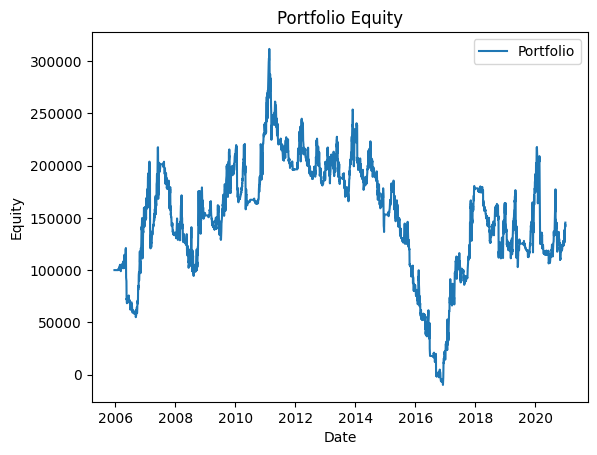
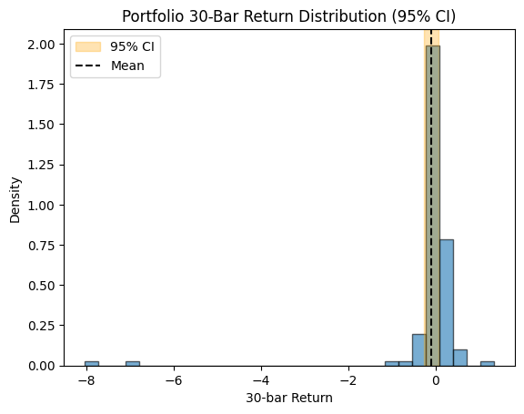

# Backtest Summary: `13:26 08.08.2025`

**Run date:** 2025-08-08 13:41

**Contents:**

- [1. Combined Statistics](#1-combined-statistics)

- [2. Per-Asset Permutation Tests](#2-per-asset-permutation-tests)

- [3. Multiple-System Selection Bias](#3-multiple-system-selection-bias)

- [4. Key Charts](#4-key-charts)

- [5. Correlation Analysis](#5-correlation-analysis)

## 1. Combined Statistics

| Instrument | cagr | annual_vol | sharpe | sortino | max_drawdown | avg_drawdown | avg_dd_duration | profit_factor | expectancy | win_rate | std_daily | 5th pctile | 95th pctile | avg_win | avg_loss | max_loss_pct | Cost %/Trade | Sharpe (no cost) |
| --- | --- | --- | --- | --- | --- | --- | --- | --- | --- | --- | --- | --- | --- | --- | --- | --- | --- | --- |
| SP500 (ewmac) | -25.9% | 1438.8% | 0.03 | 0.04 | 171.9% | 37.0% | 32.59405940594059 | 1.07 | 199.42 | 26.8% | 0.91 | -13.7% | 12.3% | 9.9% | -10.0% | -1712.5% | 0.2% | 0.00 |
| SP500 (trend breakout) | N/A | 3313.3% | 0.25 | 1.09 | 167.7% | 38.3% | 21.32824427480916 | 1.36 | 1482.61 | 35.5% | 2.09 | -12.5% | 11.9% | 15.6% | -8.7% | -1399.2% | 0.2% | -0.25 |
| **DAX (ewmac)** | -9.2% | 200.2% | 0.63 | 1.11 | 98.5% | 36.2% | 28.652173913043477 | 1.08 | 186.61 | 23.9% | 0.13 | -9.8% | 10.2% | 6.0% | -4.8% | -78.0% | 0.1% | 0.60 |
| DAX (trend breakout) | -14.5% | 1424.9% | 0.01 | 0.01 | 182.6% | 51.6% | 26.74774774774775 | 0.87 | -499.99 | 30.0% | 0.90 | -15.2% | 14.9% | 15.1% | -15.2% | -2441.2% | 0.1% | -0.29 |
| Portfolio | 2.5% | 2345.5% | 0.13 | 0.19 | 103.1% | 43.6% | 96.5897435897436 | 1.01 | 13.47 | 53.0% | 1.48 | N/A | N/A | N/A | N/A | N/A | N/A | N/A |

## 2. Per-Asset Permutation Tests

| Instrument           |   Test 1 p |   Test 2 p |   Trend | Bias     |   Skill |
|:---------------------|-----------:|-----------:|--------:|:---------|--------:|
| SP500-ewmac          |      0.001 |      0.001 |       0 | -99.78%  |      -0 |
| SP500-trend breakout |      0.001 |      0.001 |       0 | 87.47%   |      -0 |
| DAX-ewmac            |      0.001 |      0.001 |       0 | 132.50%  |       0 |
| DAX-trend breakout   |      1     |      0.001 |       0 | 1050.17% |      -0 |

## 3. Multiple-System Selection Bias

| Instrument   | Strategy       |   solo_p |   unbiased_p |
|:-------------|:---------------|---------:|-------------:|
| SP500        | ewmac          |    0.935 |        0.001 |
| SP500        | trend breakout |    0.621 |        0.621 |
| DAX          | ewmac          |    0.99  |        0.001 |
| DAX          | trend breakout |    0.451 |        0.001 |

## 4. Key Charts

### Equity Curves

### Drawdowns

### Portfolio Equity

### 30-Bar Return Dist.

## 5. Correlation Analysis

### Strategy Return Correlation

| index          |   ewmac |   trend breakout |
|:---------------|--------:|-----------------:|
| ewmac          |    1.00 |             0.00 |
| trend breakout |    0.00 |             1.00 |

### Asset Return Correlation

| index                  |   SP500 (ewmac) |   SP500 (trend breakout) |   DAX (ewmac) |   DAX (trend breakout) |
|:-----------------------|----------------:|-------------------------:|--------------:|-----------------------:|
| SP500 (ewmac)          |            1.00 |                    -0.00 |          0.02 |                   0.00 |
| SP500 (trend breakout) |           -0.00 |                     1.00 |          0.01 |                  -0.00 |
| DAX (ewmac)            |            0.02 |                     0.01 |          1.00 |                   0.02 |
| DAX (trend breakout)   |            0.00 |                    -0.00 |          0.02 |                   1.00 |

