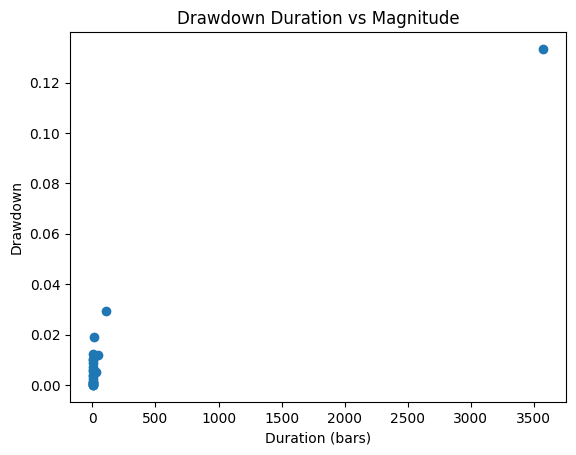

# Backtest Summary: `14:14 14.07.2025 (ewmac)`

**Run date:** 2025-07-14 14:14

**Strategy:** `ewmac.ewmac`

## 2. Combined Statistics

| cagr | annual_vol | sharpe | sortino | max_drawdown | avg_drawdown | avg_dd_duration | pf | expectancy | win_rate | std_daily | ret_5pct | ret_95pct |
| --- | --- | --- | --- | --- | --- | --- | --- | --- | --- | --- | --- | --- |
| 0.0061020362000168 | 0.0576850364436571 | 0.1344123694008584 | 0.1349546865796322 | 0.1028436932965237 | 0.0293854902181492 | 26.875968992248065 | 1.0596642831652383 | 24.541365378904135 | 3.29004329004329 | 0.0036338157333241 | -0.0053580641098924 | 0.0057464498530118 |
| 0.0051969215709679 | 0.0389829947101065 | 0.1524734314947311 | 0.0711320032172595 | 0.1117564368760808 | 0.0357764151123459 | 28.0625 | 1.343604984520996 | 471.1955781565021 | 8.387096774193548 | 0.0024556978419878 | -0.000710729470199 | 0.0016838832067436 |
| -0.0002122351467076 | 0.050208659581343 | 0.0210781999554781 | 0.0185672980387222 | 0.133328975642958 | 0.071478806875293 | 166.2173913043478 | nan | 4.454903406048892 | 0.5206273440163655 | 0.0031628482598603 | nan | nan |

## 3. Advanced Statistical Tests

### 3.2 Portfolio Tests

| actual_mean | actual_log_pf | actual_drawdown | num_nonzero_rets | bs_mean_0.1% | bs_log_pf_0.1% | bs_dd_0.1% | bs_mean_1.0% | bs_log_pf_1.0% | bs_dd_1.0% | bs_mean_5.0% | bs_log_pf_5.0% | bs_dd_5.0% | bs_mean_10.0% | bs_log_pf_10.0% | bs_dd_10.0% | bs_mean_90.0% | bs_log_pf_90.0% | bs_dd_90.0% | bs_mean_95.0% | bs_log_pf_95.0% | bs_dd_95.0% | bs_mean_99.0% | bs_log_pf_99.0% | bs_dd_99.0% | perm_dd_0.1% | perm_dd_1.0% | perm_dd_5.0% | perm_dd_10.0% | perm_dd_90.0% | perm_dd_95.0% | perm_dd_99.0% | avg_bs_dd | avg_perm_dd | p_two_sided_mean | p_two_sided_log_pf | p_one_sided_drawdown |
| --- | --- | --- | --- | --- | --- | --- | --- | --- | --- | --- | --- | --- | --- | --- | --- | --- | --- | --- | --- | --- | --- | --- | --- | --- | --- | --- | --- | --- | --- | --- | --- | --- | --- | --- | --- | --- |
| 5.42511218491612e-06 | 0.0061249342496436 | 0.1333289756429595 | 3002.0 | -0.0002009167037698 | -0.2283694746020375 | 0.0671293476735179 | -0.0001498687151915 | -0.157324888049843 | 0.0775472729638699 | -9.401658553628324e-05 | -0.1038207119869548 | 0.1006863838801692 | -7.137315849272296e-05 | -0.0797449113426563 | 0.1158678677073907 | 9.097099784002924e-05 | 0.1038883331216626 | 0.3063224311500566 | 0.0001114580467048 | 0.1277827978060285 | 0.3427674380500569 | 0.0001570964160767 | 0.1738758611087053 | 0.4186331539708362 | 0.1065280046429921 | 0.1204947939988564 | 0.1326087668141851 | 0.1437094802725254 | 0.255659827006396 | 0.2739754185492133 | 0.306483185682015 | 0.2061495124434617 | 0.19664294865783 | 0.937 | 0.937 | 0.054 |

## 4. Key Charts

### Portfolio Equity

### 30-Bar Return Distribution

### Drawdown Distribution

### Drawdown Duration vs Magnitude

