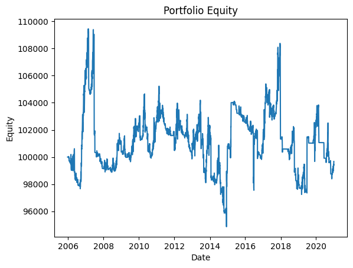
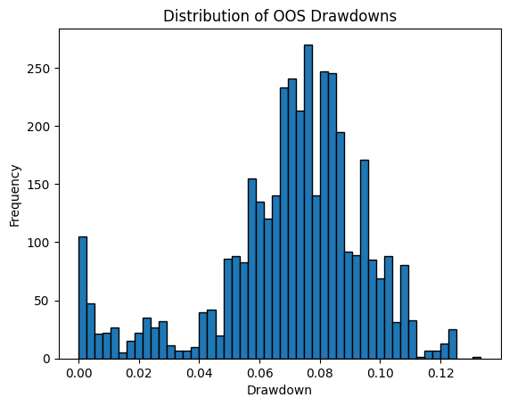

# Backtest Summary: `14:23 14.07.2025 (ewmac)`

**Run date:** 2025-07-14 14:23

**Strategy:** `ewmac.ewmac`

| Instrument | cagr | annual_vol | sharpe | sortino | max_drawdown | avg_drawdown | avg_dd_duration | pf | expectancy | win_rate | std_daily | ret_5pct | ret_95pct |
| --- | --- | --- | --- | --- | --- | --- | --- | --- | --- | --- | --- | --- | --- |
| SP500 | 0.0061 | 0.0577 | 0.1344 | 0.135 | 0.1028 | 0.0294 | 26.876 | 1.0597 | 24.5414 | 3.29 | 0.0036 | -0.0054 | 0.0057 |
| DAX | 0.0052 | 0.039 | 0.1525 | 0.0711 | 0.1118 | 0.0358 | 28.0625 | 1.3436 | 471.1956 | 8.3871 | 0.0025 | -0.0007 | 0.0017 |
| Portfolio | -0.0002 | 0.0502 | 0.0211 | 0.0186 | 0.1333 | 0.0715 | 166.2174 | nan | 4.4549 | 0.5206 | 0.0032 | nan | nan |

## 3. Advanced Portfolio Statistical Tests

#### 3.1 Actual Metrics

| Metric | Value |
| --- | --- |
| actual_mean | 0.0 |
| actual_log_pf | 0.0061 |
| actual_drawdown | 0.1333 |
| num_nonzero_rets | 3002.0 |

#### 3.2 Bootstrap Quantiles

| Quantile | Value |
| --- | --- |
| bs_mean_0.1% | -0.0002 |
| bs_log_pf_0.1% | -0.2315 |
| bs_dd_0.1% | 0.0542 |
| bs_mean_1.0% | -0.0002 |
| bs_log_pf_1.0% | -0.1736 |
| bs_dd_1.0% | 0.0813 |
| bs_mean_5.0% | -0.0001 |
| bs_log_pf_5.0% | -0.1129 |
| bs_dd_5.0% | 0.102 |
| bs_mean_10.0% | -0.0001 |
| bs_log_pf_10.0% | -0.0865 |
| bs_dd_10.0% | 0.1158 |
| bs_mean_90.0% | 0.0001 |
| bs_log_pf_90.0% | 0.1014 |
| bs_dd_90.0% | 0.3166 |
| bs_mean_95.0% | 0.0001 |
| bs_log_pf_95.0% | 0.1303 |
| bs_dd_95.0% | 0.3558 |
| bs_mean_99.0% | 0.0002 |
| bs_log_pf_99.0% | 0.1979 |
| bs_dd_99.0% | 0.4383 |

#### 3.3 Permutation DD & p-value

| Quantile/Metric | Value |
| --- | --- |
| perm_dd_0.1% | 0.1062 |
| perm_dd_1.0% | 0.1159 |
| perm_dd_5.0% | 0.133 |
| perm_dd_10.0% | 0.1429 |
| perm_dd_90.0% | 0.2504 |
| perm_dd_95.0% | 0.2665 |
| perm_dd_99.0% | 0.2965 |
| p_one_sided_drawdown | 0.051 |

## 4. Key Charts

### Portfolio Equity

### 30-Bar Return Distribution

### Drawdown Distribution

### Drawdown Duration vs Magnitude

