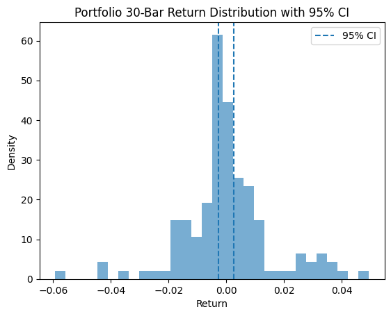

# Backtest Summary: `14:28 14.07.2025 (ewmac)`

**Run date:** 2025-07-14 14:28

**Strategy:** `ewmac.ewmac`

## 2. Combined Statistics

| Instrument | cagr | sharpe | max_drawdown | win_rate | expectancy | annual_vol | std_daily | ret_5pct | ret_95pct |
| --- | --- | --- | --- | --- | --- | --- | --- | --- | --- |
| SP500 | 0.61% | 0.13 | 10.28% | 329.00% | 24.54 | 5.77% | 0.00 | -0.54% | 0.57% |
| DAX | 0.52% | 0.15 | 11.18% | 838.71% | 471.20 | 3.90% | 0.00 | -0.07% | 0.17% |
| Portfolio | -0.02% | 0.02 | 13.33% | 52.06% | 4.45 | 5.02% | 0.00 | nan% | nan% |

## 3. Advanced Portfolio Statistical Tests

### 3.1 Actual Metrics

| Metric | Value |
| --- | --- |
| Mean (%) | 0.00% |
| Log PF | 0.01 |
| Drawdown (%) | 13.33% |
| Non-zero Bars | 3002 |

### 3.2 Bootstrap Quantiles

| Quantile | Value |
| --- | --- |
| Mean 0.1% | -0.02% |
| Log Pf 0.1% | -0.22 |
| Dd 0.1% | 6.34% |
| Mean 1.0% | -0.01% |
| Log Pf 1.0% | -0.16 |
| Dd 1.0% | 7.81% |
| Mean 5.0% | -0.01% |
| Log Pf 5.0% | -0.11 |
| Dd 5.0% | 9.97% |
| Mean 10.0% | -0.01% |
| Log Pf 10.0% | -0.09 |
| Dd 10.0% | 11.21% |
| Mean 90.0% | 0.01% |
| Log Pf 90.0% | 0.12 |
| Dd 90.0% | 31.55% |
| Mean 95.0% | 0.01% |
| Log Pf 95.0% | 0.15 |
| Dd 95.0% | 35.47% |
| Mean 99.0% | 0.02% |
| Log Pf 99.0% | 0.18 |
| Dd 99.0% | 41.49% |

### 3.3 Permutation Drawdown Quantiles & P-Value

| Quantile | Value |
| --- | --- |
| 0.1% | 10.66% |
| 1.0% | 12.06% |
| 5.0% | 13.46% |
| 10.0% | 14.52% |
| 90.0% | 25.08% |
| 95.0% | 27.44% |
| 99.0% | 31.54% |
| P Value (One-sided) | 0.047 |

## 4. Key Charts

### Portfolio Equity

### 30-Bar Return Distribution

### Drawdown Distribution

### Drawdown Duration vs Magnitude

