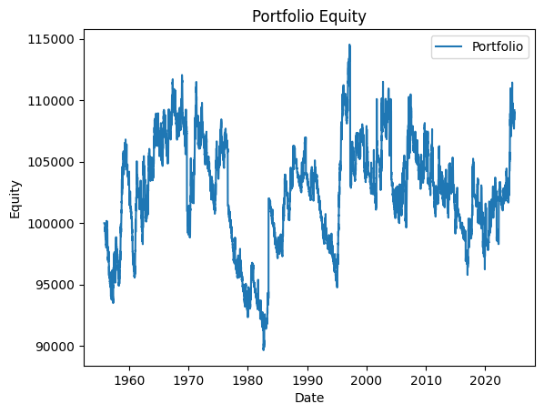
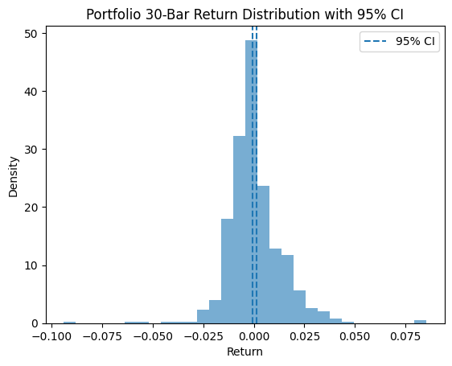
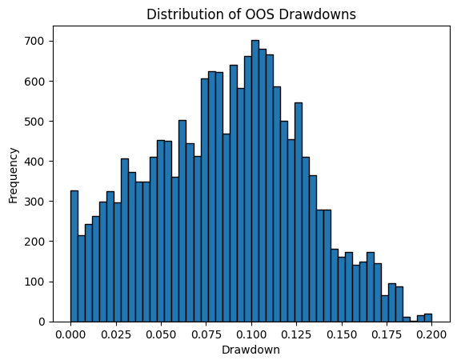
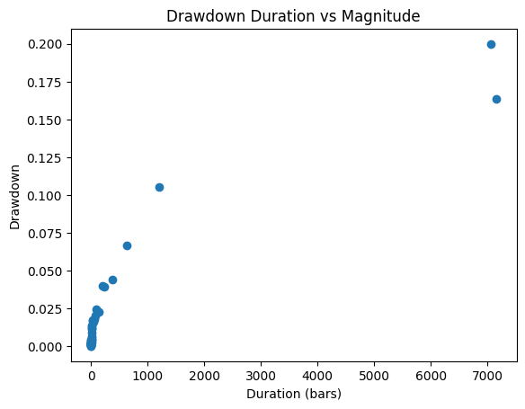

# Backtest Summary: `14:28 30.07.2025 (ewmac)`

**Run date:** 2025-07-30 15:03

**Strategy:** `ewmac.ewmac`

**Contents:**

- [1. Combined Statistics](#1-combined-statistics)

- [2. Per-Asset Permutation Tests](#2-per-asset-permutation-tests)

- [3. Multiple-System Selection Bias](#3-multiple-system-selection-bias)

- [4. Key Charts](#4-key-charts)

## 1. Combined Statistics

| Instrument | cagr | annual_vol | sharpe | sortino | max_drawdown | avg_drawdown | avg_dd_duration | profit_factor | expectancy | win_rate | std_daily | 5th pctile | 95th pctile | avg_win | avg_loss | max_loss_pct |
| --- | --- | --- | --- | --- | --- | --- | --- | --- | --- | --- | --- | --- | --- | --- | --- | --- |
| **SP500** | 0.7% | 5.9% | 0.15 | 0.18 | 22.3% | 6.8% | 95.09 | 1.03 | 6.21 | 78.8% | 0.00 | -0.6% | 0.6% | 0.2% | -0.2% | -4.8% |
| DAX | 0.4% | 4.3% | 0.12 | 0.09 | 11.3% | 3.1% | 62.04 | 1.14 | 230.48 | 558.7% | 0.00 | -0.4% | 0.4% | 0.3% | -0.3% | -3.5% |
| Portfolio | 0.1% | 4.0% | 0.05 | 0.05 | 20.0% | 8.6% | 387.64 | 1.03 | 4.82 | 50.8% | 0.00 | N/A | N/A | N/A | N/A | N/A |

## 2. Per-Asset Permutation Tests

| Instrument | Test 1 p | Test 2 p | Trend | Bias | Skill |
| --- | --- | --- | --- | --- | --- |
| SP500 | 0.001 | 0.001 | 0.0 | -86.69% | 0.00 |
| DAX | 0.001 | 0.001 | 0.0 | 136.31% | 0.00 |

## 3. Multiple-System Selection Bias

| System | unbiased_p |
| --- | --- |
| 0.74 | 0.742 |
| 0.19 | 0.001 |

## 4. Key Charts

### Portfolio Equity

### 30-Bar Return Dist.

### Drawdown Distribution

### DD Duration vs Magnitude

