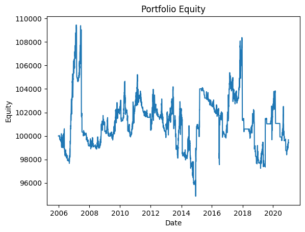

# Backtest Summary: `14:41 14.07.2025 (ewmac)`

**Run date:** 2025-07-14 14:42

**Strategy:** `ewmac.ewmac`

## 2. Combined Statistics

| Instrument | cagr | sharpe | max_drawdown | win_rate | expectancy | annual_vol | std_daily | ret_5pct | ret_95pct |
| --- | --- | --- | --- | --- | --- | --- | --- | --- | --- |
| SP500 | 0.61% | 0.13 | 10.28% | 329.00% | 24.54 | 5.77% | 0.00 | -0.54% | 0.57% |
| **DAX** | 0.52% | 0.15 | 11.18% | 838.71% | 471.20 | 3.90% | 0.00 | -0.07% | 0.17% |
| Portfolio | -0.02% | 0.02 | 13.33% | 52.06% | 4.45 | 5.02% | 0.00 | N/A | N/A |

## 3. Advanced Portfolio Statistical Tests

### 3.1 Actual Metrics

| Metric | Value |
| --- | --- |
| Mean (%) | 0.00% |
| Log PF | 0.01 |
| Drawdown (%) | 13.33% |
| Non-zero Bars | 3002 |

### 3.2 Bootstrap Quantiles

| mean_0.1% | log_pf_0.1% | dd_0.1% | mean_1.0% | log_pf_1.0% | dd_1.0% | mean_5.0% | log_pf_5.0% | dd_5.0% | mean_10.0% | log_pf_10.0% | dd_10.0% | mean_90.0% | log_pf_90.0% | dd_90.0% | mean_95.0% | log_pf_95.0% | dd_95.0% | mean_99.0% | log_pf_99.0% | dd_99.0% |
| --- | --- | --- | --- | --- | --- | --- | --- | --- | --- | --- | --- | --- | --- | --- | --- | --- | --- | --- | --- | --- |
| -0.02% | -0.21 | 7.07% | -0.02% | -0.17 | 8.52% | -0.01% | -0.12 | 10.47% | -0.01% | -0.09 | 11.89% | 0.01% | 0.10 | 31.80% | 0.01% | 0.13 | 35.67% | 0.02% | 0.17 | 42.57% |

### 3.3 Permutation Drawdown Quantiles & P-Value

| 0.1% | 1.0% | 5.0% | 10.0% | 90.0% | 95.0% | 99.0% | p_one_sided_drawdown |
| --- | --- | --- | --- | --- | --- | --- | --- |
| 9.80% | 11.47% | 13.11% | 14.18% | 25.25% | 27.05% | 30.76% | 0.060 |

## 4. Key Charts

### Portfolio Equity

### 30-Bar Return Dist.

### Drawdown Distribution

### DD Duration vs Magnitude

