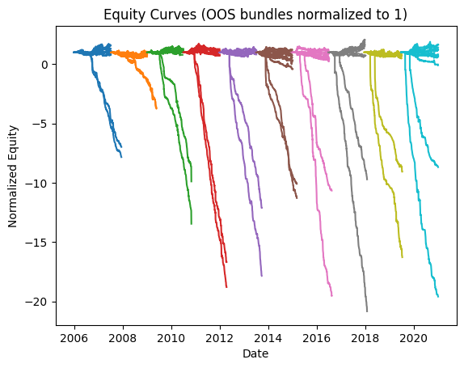
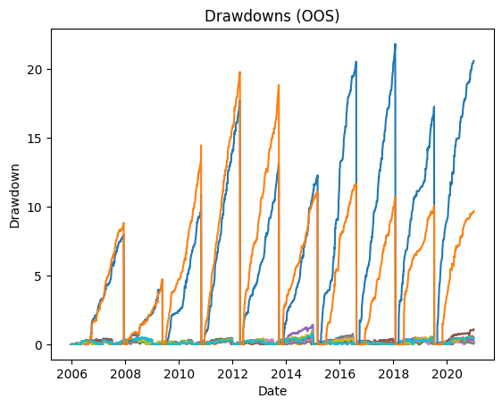
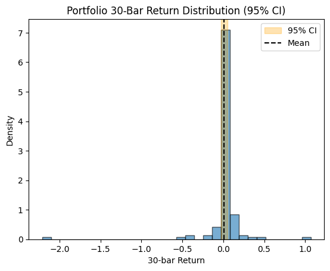

# Backtest Summary: `16:07 11.08.2025`

**Run date:** 2025-08-11 16:07

**Contents:**

- [1. Combined Statistics](#1-combined-statistics)

- [2. Per-Asset Permutation Tests](#2-per-asset-permutation-tests)

- [3. Multiple-System Selection Bias](#3-multiple-system-selection-bias)

- [4. Key Charts](#4-key-charts)

- [5. Correlation Analysis](#5-correlation-analysis)

## 1. Combined Statistics

| Instrument | cagr | total_return | mean_annual_return | annualised_return_log | annual_vol | sharpe | sortino | skew | max_drawdown | avg_drawdown | avg_dd_duration | profit_factor | expectancy | win_rate | std_daily | 5th pctile | 95th pctile | avg_win | avg_loss | max_loss_pct | avg_30d_ret | avg_30d_ret_plus_2std | avg_30d_ret_minus_2std | avg_30d_ret_ci_low | avg_30d_ret_ci_high | Cost %/Trade | cost_sharp |
| --- | --- | --- | --- | --- | --- | --- | --- | --- | --- | --- | --- | --- | --- | --- | --- | --- | --- | --- | --- | --- | --- | --- | --- | --- | --- | --- | --- |
| SP500 (ewmac) | -7.6% | 0.2463023658691405 | 0.0097771304282932 | -0.075683916795712 | 42.6% | 0.04 | 0.03 | -1.818374031165266 | 74.3% | 17.6% | 30.941747572815533 | 0.96 | -19.84 | 28.3% | 0.03 | -3.6% | 4.0% | 1.8% | -2.0% | -37.8% | 0.0013952341733046 | 0.2322179141186376 | -0.2294274457720282 | -0.0196633833367763 | 0.0224538516833856 | 0.3% | 0.0472777893082329 |
| SP500 (trend_breakout) | 0.7% | 0.4182637077832032 | 0.0749519687622895 | 0.0065556276350637 | 36.1% | 0.20 | 0.19 | -1.6687925878083294 | 67.3% | 17.9% | 21.345864661654137 | 1.51 | 259.24 | 38.7% | 0.02 | -3.4% | 3.3% | 1.7% | -1.8% | -30.2% | 0.0086805718363471 | 0.2206943219468124 | -0.2033331782741182 | -0.0106482348652819 | 0.0280093785379762 | 0.3% | 0.0273701610731981 |
| DAX (ewmac) | 0.4% | 0.2062192700007614 | 0.0277840460196367 | 0.0038225866480606 | 35.7% | 0.19 | 0.22 | 0.0302785757714912 | 51.5% | 16.6% | 28.728070175438596 | 1.15 | 59.22 | 37.3% | 0.02 | -3.5% | 3.4% | 1.8% | -1.8% | -16.3% | 0.0067806525456223 | 0.2162455664183975 | -0.2026842613271529 | -0.012249387903548 | 0.0258106929947926 | 0.1% | 0.0337480603596126 |
| DAX (trend_breakout) | -1.8% | -0.3649555404551313 | 0.0140869991516215 | -0.0184723699051595 | 31.8% | 0.10 | 0.11 | -0.4840285003490555 | 58.3% | 17.3% | 24.265625 | 1.04 | 12.53 | 32.8% | 0.02 | -3.1% | 3.2% | 1.6% | -1.7% | -14.3% | 0.0033863579819351 | 0.208225203504448 | -0.2014524875405778 | -0.015202810479833 | 0.0219755264437032 | 0.1% | 0.0348306460009668 |
| FTSE (ewmac) | N/A | -0.2697145640413553 | -0.2646992236030523 | -0.3787205405787398 | 351.1% | -0.52 | -0.34 | -34.61073405832774 | 141.7% | 27.8% | 48.98550724637681 | 0.33 | -382.39 | 20.3% | 0.22 | -4.9% | 4.5% | 2.8% | -4.5% | -1056.4% | -0.044858078820403 | 5.194074361024221 | -5.283790518665027 | -0.5221712068168116 | 0.4324550491760054 | 0.1% | 0.5367042643753308 |
| FTSE (trend_breakout) | -100.0% | -1.0764962410230052 | -0.1787762400164453 | -0.2230642786062704 | 172.6% | -0.02 | -0.02 | 10.108843142562511 | 107.6% | 25.1% | 43.294117647058826 | 0.27 | -613.86 | 24.2% | 0.11 | -4.5% | 3.9% | 2.9% | -3.0% | -235.0% | -0.0322605091680155 | 0.3719876442557278 | -0.4365086625917588 | -0.0602413282797873 | -0.0042796900562437 | 0.1% | -0.1261534137070082 |
| NASDAQ (ewmac) | -6.1% | 0.6556951771171875 | -0.0004582131228104 | -0.0609205829432661 | 36.4% | 0.01 | 0.01 | -1.1882231390448463 | 73.4% | 16.4% | 29.444444444444443 | 0.98 | -8.30 | 30.0% | 0.02 | -3.6% | 3.4% | 1.5% | -1.7% | -22.4% | 0.00070151086494 | 0.2110953968542434 | -0.2096923751243634 | -0.0184931836357241 | 0.0198962053656042 | 0.1% | 0.0929001069807177 |
| NASDAQ (trend_breakout) | -4.7% | 0.6490481864062501 | 0.0132028700869939 | -0.0471060344734157 | 34.9% | 0.04 | 0.04 | -1.4871312435820616 | 76.0% | 16.6% | 26.669565217391305 | 1.14 | 57.55 | 30.6% | 0.02 | -3.5% | 3.3% | 1.5% | -1.7% | -27.9% | 0.002440282080126 | 0.2103026655191913 | -0.2054221013589393 | -0.0165139663152676 | 0.0213945304755196 | 0.1% | 0.0678829341266801 |
| DJ30 (ewmac) | -10.8% | -0.27849107484375 | 0.0029715481645054 | -0.1077597778264947 | 1294.7% | 0.26 | 4.37 | 61.10409244734244 | 99.9% | 22.0% | 28.878504672897197 | 0.98 | -14.27 | 21.3% | 0.82 | -4.1% | 4.1% | 6.2% | -2.5% | -96.7% | -0.0030432170127016 | 0.2618105355477445 | -0.2678969695731477 | -0.0272162507431234 | 0.0211298167177201 | 0.0% | -0.0931639313082897 |
| DJ30 (trend_breakout) | -7.2% | -0.182804268046875 | 0.0107825712037505 | -0.0720464349093635 | 42.1% | 0.04 | 0.04 | -1.05842780397746 | 82.3% | 21.2% | 27.309734513274336 | 1.02 | 8.92 | 28.0% | 0.03 | -4.2% | 3.8% | 2.0% | -2.2% | -32.0% | 0.0014901849948615 | 0.2589931595567954 | -0.2560127895670724 | -0.0220095861361493 | 0.0249899561258723 | 0.0% | 0.0321114395071433 |
| NG (ewmac) | -100.0% | -20.60375883557276 | -7.506369468504908 | 6.730311487294515 | 1762.6% | 0.26 | 0.26 | 29.01439156346084 | 2184.6% | 773.7% | 333.2 | 0.00 | -16768.23 | 0.0% | 1.11 | -1.8% | 5.4% | 5.7% | -9.1% | -2946.2% | 0.221820161890434 | 63.07887817567811 | -62.63523785189725 | -5.62414419167256 | 6.067784515453429 | 88.8% | -0.457264930720356 |
| **NG (trend_breakout)** | -100.0% | -9.68368120220332 | 3.2935033784570975 | 6.291533346038197 | 249.0% | 0.69 | 0.40 | -6.658879269284859 | 1980.2% | 664.9% | 313.5 | 0.00 | -15611.12 | 0.0% | 0.16 | -1.2% | 5.5% | 2.7% | -5.4% | -424.5% | 0.1540224350730796 | 6.000350181685117 | -5.692305311538958 | -0.3896965490843135 | 0.6977414192304727 | 81.1% | -0.7119641913436271 |
| Portfolio | N/A | -22.581843375821823 | 0.2269792216947948 | 0.0871449088956931 | 216.7% | -0.01 | -0.00 | -30.068604817999702 | 2105.0% | 924.5% | 318.6666666666667 | 0.35 | -592.24 | 34.8% | 0.14 | -1.5% | 1.7% | 0.9% | -1.5% | -714.9% | 0.0128141423773871 | 3.4139259581937025 | -3.388297673438928 | -0.282177818796167 | 0.3078061035509414 | N/A | nan |

## 2. Per-Asset Permutation Tests

| Instrument            | Test 1 p   | Test 2 p   | Trend   | Bias   | Skill   |
|:----------------------|:-----------|:-----------|:--------|:-------|:--------|
| SP500-ewmac           | N/A        | N/A        | N/A     | N/A    | N/A     |
| SP500-trend_breakout  | N/A        | N/A        | N/A     | N/A    | N/A     |
| DAX-ewmac             | N/A        | N/A        | N/A     | N/A    | N/A     |
| DAX-trend_breakout    | N/A        | N/A        | N/A     | N/A    | N/A     |
| FTSE-ewmac            | N/A        | N/A        | N/A     | N/A    | N/A     |
| FTSE-trend_breakout   | N/A        | N/A        | N/A     | N/A    | N/A     |
| NASDAQ-ewmac          | N/A        | N/A        | N/A     | N/A    | N/A     |
| NASDAQ-trend_breakout | N/A        | N/A        | N/A     | N/A    | N/A     |
| DJ30-ewmac            | N/A        | N/A        | N/A     | N/A    | N/A     |
| DJ30-trend_breakout   | N/A        | N/A        | N/A     | N/A    | N/A     |
| NG-ewmac              | N/A        | N/A        | N/A     | N/A    | N/A     |
| NG-trend_breakout     | N/A        | N/A        | N/A     | N/A    | N/A     |

## 4. Key Charts

### Equity Curves

### Drawdowns

### 30-Bar Return Dist.

## 5. Correlation Analysis

### Strategy Return Correlation

| index          |   ewmac |   trend_breakout |
|:---------------|--------:|-----------------:|
| ewmac          |    1.00 |             0.14 |
| trend_breakout |    0.14 |             1.00 |

### Asset Return Correlation

| index                   |   SP500 (ewmac) |   SP500 (trend_breakout) |   DAX (ewmac) |   DAX (trend_breakout) |   FTSE (ewmac) |   FTSE (trend_breakout) |   NASDAQ (ewmac) |   NASDAQ (trend_breakout) |   DJ30 (ewmac) |   DJ30 (trend_breakout) |   NG (ewmac) |   NG (trend_breakout) |
|:------------------------|----------------:|-------------------------:|--------------:|-----------------------:|---------------:|------------------------:|-----------------:|--------------------------:|---------------:|------------------------:|-------------:|----------------------:|
| SP500 (ewmac)           |            1.00 |                     0.76 |          0.38 |                   0.37 |           0.05 |                    0.09 |             0.84 |                      0.68 |           0.10 |                    0.74 |         0.02 |                  0.01 |
| SP500 (trend_breakout)  |            0.76 |                     1.00 |          0.31 |                   0.33 |           0.02 |                    0.09 |             0.68 |                      0.81 |           0.08 |                    0.67 |         0.01 |                  0.01 |
| DAX (ewmac)             |            0.38 |                     0.31 |          1.00 |                   0.78 |           0.09 |                    0.11 |             0.39 |                      0.31 |           0.01 |                    0.34 |         0.06 |                  0.03 |
| DAX (trend_breakout)    |            0.37 |                     0.33 |          0.78 |                   1.00 |           0.06 |                    0.08 |             0.36 |                      0.28 |           0.01 |                    0.37 |         0.05 |                  0.03 |
| FTSE (ewmac)            |            0.05 |                     0.02 |          0.09 |                   0.06 |           1.00 |                    0.02 |             0.06 |                      0.02 |           0.00 |                    0.07 |         0.01 |                  0.00 |
| FTSE (trend_breakout)   |            0.09 |                     0.09 |          0.11 |                   0.08 |           0.02 |                    1.00 |             0.07 |                      0.07 |           0.00 |                    0.09 |         0.01 |                  0.01 |
| NASDAQ (ewmac)          |            0.84 |                     0.68 |          0.39 |                   0.36 |           0.06 |                    0.07 |             1.00 |                      0.80 |           0.08 |                    0.61 |         0.00 |                  0.00 |
| NASDAQ (trend_breakout) |            0.68 |                     0.81 |          0.31 |                   0.28 |           0.02 |                    0.07 |             0.80 |                      1.00 |           0.07 |                    0.51 |        -0.00 |                  0.01 |
| DJ30 (ewmac)            |            0.10 |                     0.08 |          0.01 |                   0.01 |           0.00 |                    0.00 |             0.08 |                      0.07 |           1.00 |                    0.15 |         0.00 |                 -0.00 |
| DJ30 (trend_breakout)   |            0.74 |                     0.67 |          0.34 |                   0.37 |           0.07 |                    0.09 |             0.61 |                      0.51 |           0.15 |                    1.00 |         0.02 |                 -0.00 |
| NG (ewmac)              |            0.02 |                     0.01 |          0.06 |                   0.05 |           0.01 |                    0.01 |             0.00 |                     -0.00 |           0.00 |                    0.02 |         1.00 |                  0.15 |
| NG (trend_breakout)     |            0.01 |                     0.01 |          0.03 |                   0.03 |           0.00 |                    0.01 |             0.00 |                      0.01 |          -0.00 |                   -0.00 |         0.15 |                  1.00 |

