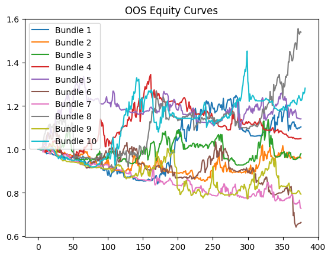
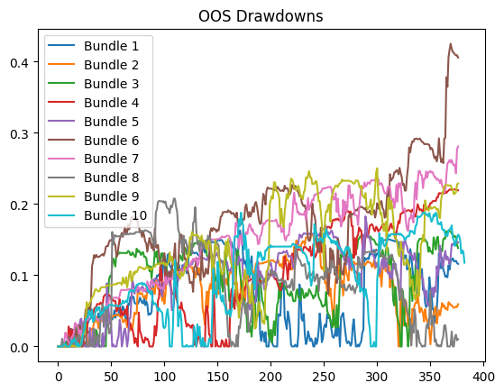
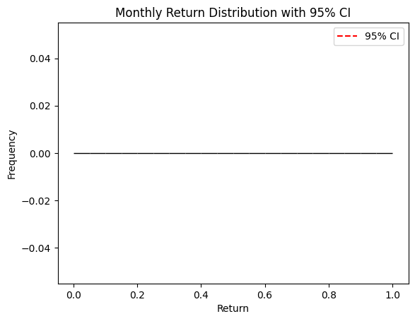
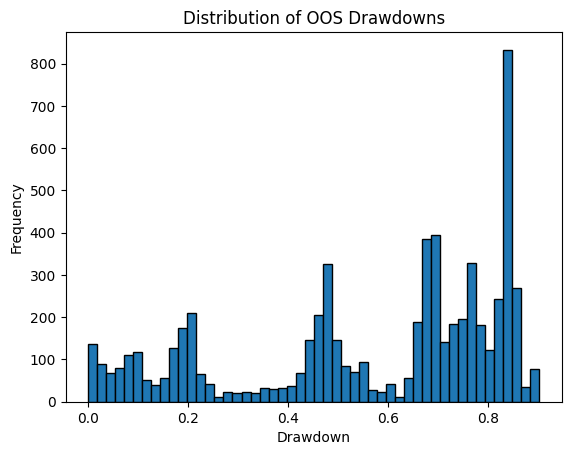
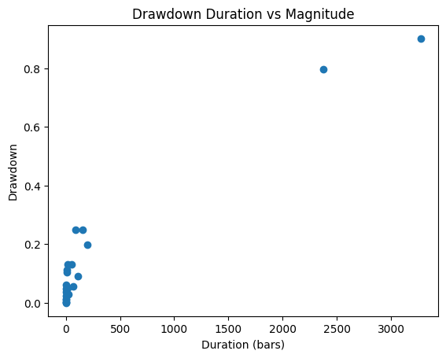
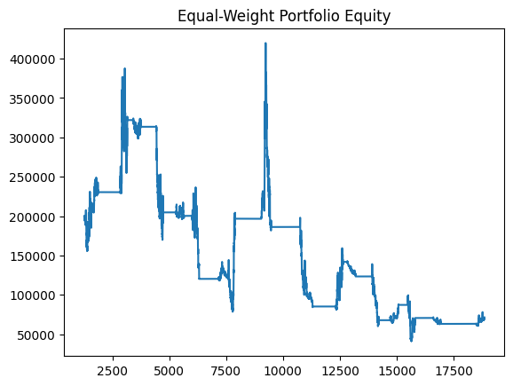

# Backtest Summary: 18:22 06.07.2025 (ewmac)
**Strategy:** `ewmac.ewmac`
**Run date:** 2025-07-06 18:22

## Per-Bundle Summary
| span_short | span_long | vol_window | forecast_scale | cap | weight | tau | capital | idm | multiplier | fx | oos_pnl | oos_sharpe | oos_max_drawdown | oos_profit_factor | oos_start_equity | oos_end_equity |
| --- | --- | --- | --- | --- | --- | --- | --- | --- | --- | --- | --- | --- | --- | --- | --- | --- |
| 10.0 | 50.0 | 32.0 | 4.1 | 20.0 | 1.0 | 0.2 | 100000.0 | 1.0 | 5.0 | 1.0 | 179474.18216705322 | 0.8601179054997442 | 0.0 | 1.1990422666695366 | 100000.0 | 279474.1821670532 |
| 10.0 | 50.0 | 32.0 | 4.1 | 20.0 | 1.0 | 0.2 | 100000.0 | 1.0 | 5.0 | 1.0 | 143507.87422180176 | 0.6907888267427955 | 0.0 | 1.1396955957124202 | 100000.0 | 243507.87422180173 |
| 10.0 | 50.0 | 32.0 | 4.1 | 20.0 | 1.0 | 0.2 | 100000.0 | 1.0 | 5.0 | 1.0 | 107904.914665222 | 0.551764985576323 | 0.0 | 1.1116470912424328 | 100000.0 | 207904.914665222 |
| 10.0 | 50.0 | 32.0 | 4.1 | 20.0 | 1.0 | 0.2 | 100000.0 | 1.0 | 5.0 | 1.0 | -19111.278800964417 | -0.1123687103174054 | 0.0 | 0.9780019679332942 | 100000.0 | 80888.7211990356 |
| 10.0 | 50.0 | 32.0 | 4.1 | 20.0 | 1.0 | 0.2 | 100000.0 | 1.0 | 5.0 | 1.0 | 24306.17095947263 | 0.1363536669054877 | 0.0 | 1.0314770298880176 | 100000.0 | 124306.1709594726 |
| 10.0 | 50.0 | 32.0 | 4.1 | 20.0 | 1.0 | 0.2 | 100000.0 | 1.0 | 5.0 | 1.0 | 75221.71600341794 | 0.4478094139036835 | 0.0 | 1.1000726173120958 | 100000.0 | 175221.71600341797 |
| 10.0 | 50.0 | 32.0 | 4.1 | 20.0 | 1.0 | 0.2 | 100000.0 | 1.0 | 5.0 | 1.0 | 36022.37335205077 | 0.2222439864188776 | 0.0 | 1.0480714694277984 | 100000.0 | 136022.37335205075 |
| 10.0 | 50.0 | 32.0 | 4.1 | 20.0 | 1.0 | 0.2 | 100000.0 | 1.0 | 5.0 | 1.0 | -9406.928710937502 | -0.0618687712589854 | 0.0 | 0.987315202905831 | 100000.0 | 90593.0712890625 |
| 10.0 | 50.0 | 32.0 | 4.1 | 20.0 | 1.0 | 0.2 | 100000.0 | 1.0 | 5.0 | 1.0 | -34785.7763671875 | -0.2236691369031315 | 0.0 | 0.9523570917038848 | 100000.0 | 65214.2236328125 |
| 10.0 | 50.0 | 32.0 | 4.1 | 20.0 | 1.0 | 0.2 | 100000.0 | 1.0 | 5.0 | 1.0 | 5452.91259765625 | 0.0291059703538237 | 0.0 | 1.0061936669631693 | 100000.0 | 105452.91259765624 |

## Aggregate Strategy Statistics
| cagr | annual_vol | sharpe | sortino | max_drawdown | profit_factor | expectancy | win_rate | std_daily |
| --- | --- | --- | --- | --- | --- | --- | --- | --- |
| -0.0392872141098457 | 0.2963955934533966 | 0.0132488010115124 | 0.0157652714545339 | 0.9021798536417502 | 1.0029457368744163 | nan | nan | 0.0186711673803117 |

## OOS Equity Curves

## OOS Drawdowns

## Monthly Return Distribution

## Drawdown Distribution

## Drawdown Duration vs Magnitude

## Equal-Weight Portfolio Equity

