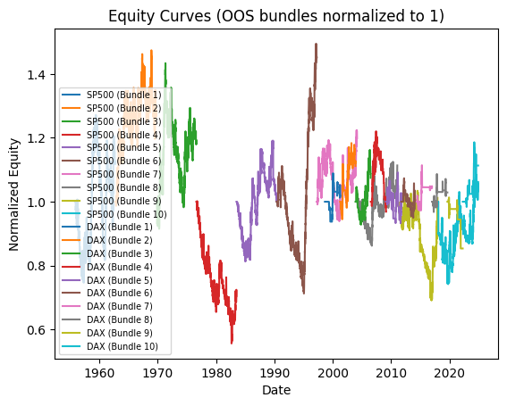
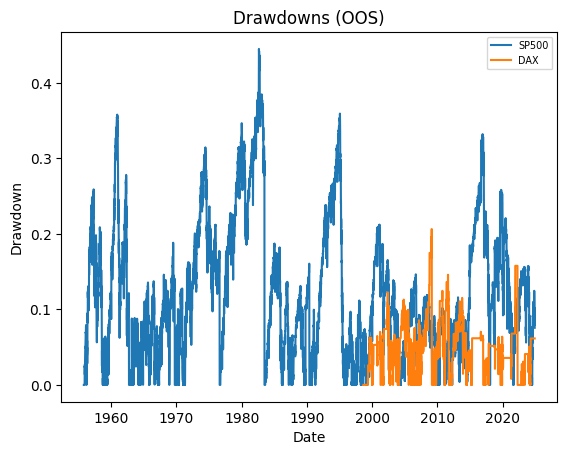
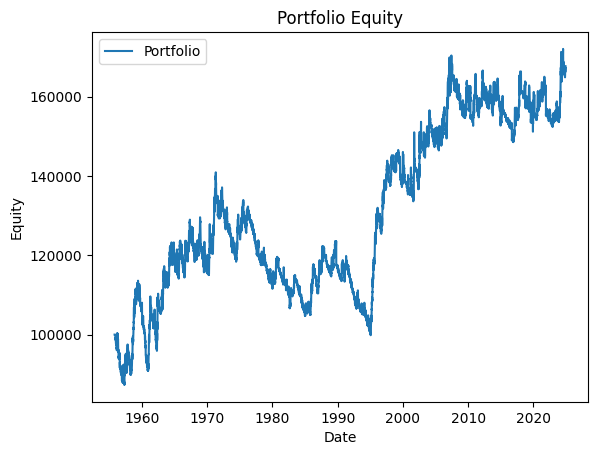
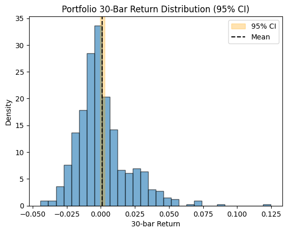
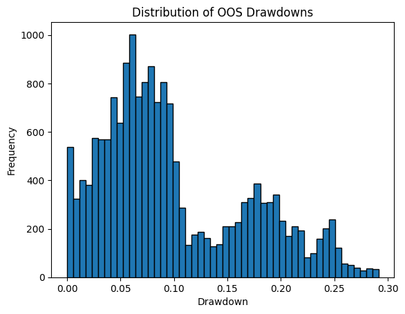
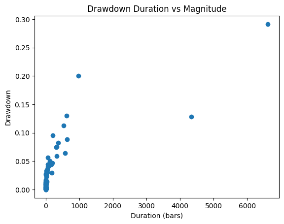

# Backtest Summary: `18:30 30.07.2025 (ewmac)`

**Run date:** 2025-07-30 18:44

**Strategy:** `ewmac.ewmac`

**Contents:**

- [1. Combined Statistics](#1-combined-statistics)

- [2. Per-Asset Permutation Tests](#2-per-asset-permutation-tests)

- [3. Multiple-System Selection Bias](#3-multiple-system-selection-bias)

- [4. Key Charts](#4-key-charts)

- [5. Correlation Analysis](#5-correlation-analysis)

## 1. Combined Statistics

| Instrument | cagr | annual_vol | sharpe | sortino | max_drawdown | avg_drawdown | avg_dd_duration | profit_factor | expectancy | win_rate | std_daily | 5th pctile | 95th pctile | avg_win | avg_loss | max_loss_pct | Cost %/Trade | Sharpe (no cost) |
| --- | --- | --- | --- | --- | --- | --- | --- | --- | --- | --- | --- | --- | --- | --- | --- | --- | --- | --- |
| **SP500** | 1.3% | 11.9% | 0.17 | 0.20 | 44.5% | 12.9% | 95.09 | 1.03 | 6.21 | 78.8% | 0.01 | -1.2% | 1.2% | 0.5% | -0.5% | -9.7% | 0.8% | 0.37 |
| DAX | 0.8% | 8.4% | 0.13 | 0.10 | 20.6% | 5.9% | 62.04 | 1.14 | 230.48 | 558.7% | 0.01 | -0.8% | 0.8% | 0.7% | -0.6% | -7.2% | 0.1% | 0.15 |
| Portfolio | 0.7% | 5.3% | 0.17 | 0.19 | 29.2% | 10.0% | 190.6 | 1.03 | 4.82 | 50.8% | 0.00 | N/A | N/A | N/A | N/A | N/A | N/A | N/A |

## 2. Per-Asset Permutation Tests

| Instrument | Test 1 p | Test 2 p | Trend | Bias | Skill |
| --- | --- | --- | --- | --- | --- |
| SP500 | 0.001 | 0.001 | 0.0 | -86.69% | 0.00 |
| DAX | 0.001 | 0.001 | 0.0 | 136.31% | 0.00 |

## 3. Multiple-System Selection Bias

| System | unbiased_p |
| --- | --- |
| 0.74 | 0.742 |
| 0.19 | 0.001 |

## 4. Key Charts

### Equity Curves

### Drawdowns

### Portfolio Equity

### 30-Bar Return Dist.

### Drawdown Distribution

### DD Duration vs Magnitude

## 5. Correlation Analysis

### Asset Return Correlation

| index | SP500 | DAX |
| --- | --- | --- |
| SP500 | 1.0 | 0.34 |
| DAX | 0.34 | 1.0 |

