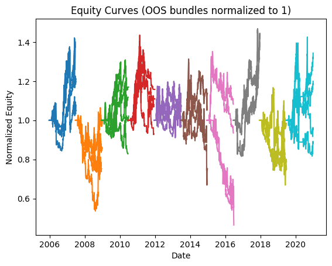
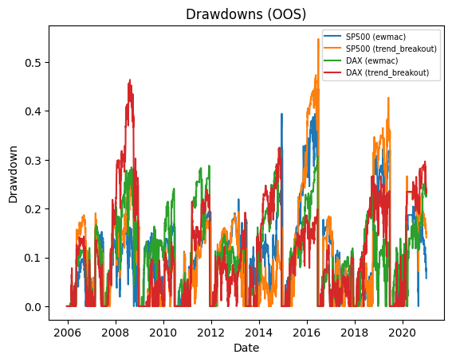
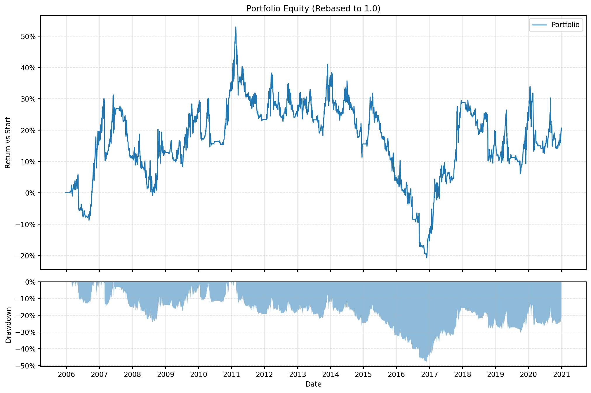
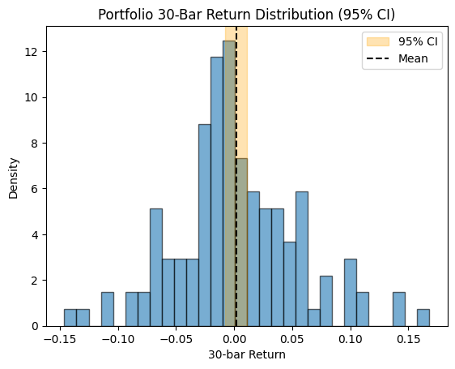

# Backtest Summary: `18:34 09.08.2025`

**Run date:** 2025-08-09 18:48

**Contents:**

- [1. Combined Statistics](#1-combined-statistics)

- [2. Per-Asset Permutation Tests](#2-per-asset-permutation-tests)

- [3. Multiple-System Selection Bias](#3-multiple-system-selection-bias)

- [4. Key Charts](#4-key-charts)

- [5. Correlation Analysis](#5-correlation-analysis)

## 1. Combined Statistics

| Instrument | cagr | annual_vol | sharpe | sortino | max_drawdown | avg_drawdown | avg_dd_duration | profit_factor | expectancy | win_rate | std_daily | 5th pctile | 95th pctile | avg_win | avg_loss | max_loss_pct | avg_30d_ret | avg_30d_ret_plus_2std | avg_30d_ret_minus_2std | avg_30d_ret_ci_low | avg_30d_ret_ci_high | Cost %/Trade | Sharpe (no cost) |
| --- | --- | --- | --- | --- | --- | --- | --- | --- | --- | --- | --- | --- | --- | --- | --- | --- | --- | --- | --- | --- | --- | --- | --- |
| SP500 (ewmac) | -1.0% | 26.1% | 0.10 | 0.10 | 44.5% | 11.9% | 29.916666666666668 | 1.13 | 100.75 | 26.9% | 0.02 | -2.5% | 2.5% | 1.1% | -1.1% | -20.1% | 0.0028816227085039 | 0.1553574559157871 | -0.1495942104987791 | 0.0003471524043636 | 0.0054160930126442 | 0.2% | 0.13 |
| SP500 (trend_breakout) | -0.9% | 24.2% | 0.09 | 0.08 | 54.8% | 13.1% | 24.033333333333335 | 1.19 | 187.75 | 27.8% | 0.02 | -2.4% | 2.2% | 1.1% | -1.1% | -21.2% | 0.0029711484755428 | 0.149178485021768 | -0.1432361880706822 | 0.0005408738219845 | 0.0054014231291012 | 0.2% | 0.11 |
| DAX (ewmac) | -0.7% | 24.3% | 0.09 | 0.11 | 31.7% | 12.5% | 30.07272727272727 | 1.02 | 14.43 | 24.0% | 0.02 | -2.4% | 2.3% | 1.1% | -1.1% | -11.5% | 0.0025129804089777 | 0.1481175980391815 | -0.1430916372212259 | 0.000103444843852 | 0.0049225159741035 | 0.0% | 0.12 |
| **DAX (trend_breakout)** | 0.7% | 22.1% | 0.14 | 0.16 | 46.4% | 13.2% | 24.06923076923077 | 1.19 | 122.61 | 29.0% | 0.01 | -2.2% | 2.1% | 1.0% | -1.0% | -10.4% | 0.003485001135014 | 0.1485067575316323 | -0.1415367552616041 | 0.0010851110392059 | 0.0058848912308222 | 0.0% | 0.17 |
| Portfolio | 1.2% | 16.5% | 0.16 | 0.17 | 48.2% | 18.8% | 101.94594594594597 | 1.02 | 6.03 | 53.2% | 0.01 | -1.6% | 1.5% | 0.7% | -0.7% | -10.8% | 0.0024824976764524 | 0.1045910414726022 | -0.0996260461196972 | 0.0008693630014868 | 0.004095632351418 | N/A | N/A |

## 2. Per-Asset Permutation Tests

| Instrument           |   Test 1 p |   Test 2 p |   Trend | Bias    |   Skill |
|:---------------------|-----------:|-----------:|--------:|:--------|--------:|
| SP500-ewmac          |      0.001 |      0.006 |       0 | -61.89% |      -0 |
| SP500-trend_breakout |      0.001 |      0.001 |       0 | -46.46% |      -0 |
| DAX-ewmac            |      0.001 |      0.001 |       0 | 0.82%   |      -0 |
| DAX-trend_breakout   |      0.001 |      0.001 |       0 | 0.77%   |       0 |

## 3. Multiple-System Selection Bias

| Instrument   | Strategy       |   solo_p |   unbiased_p |
|:-------------|:---------------|---------:|-------------:|
| SP500        | ewmac          |    0.989 |        0.001 |
| SP500        | trend_breakout |    0.61  |        0.001 |
| DAX          | ewmac          |    0.979 |        0.001 |
| DAX          | trend_breakout |    0.801 |        0.801 |

## 4. Key Charts

### Equity Curves

### Drawdowns

### Portfolio Equity

### 30-Bar Return Dist.

## 5. Correlation Analysis

### Strategy Return Correlation

| index          |   ewmac |   trend_breakout |
|:---------------|--------:|-----------------:|
| ewmac          |    1.00 |             0.85 |
| trend_breakout |    0.85 |             1.00 |

### Asset Return Correlation

| index                  |   SP500 (ewmac) |   SP500 (trend_breakout) |   DAX (ewmac) |   DAX (trend_breakout) |
|:-----------------------|----------------:|-------------------------:|--------------:|-----------------------:|
| SP500 (ewmac)          |            1.00 |                     0.82 |          0.41 |                   0.40 |
| SP500 (trend_breakout) |            0.82 |                     1.00 |          0.30 |                   0.34 |
| DAX (ewmac)            |            0.41 |                     0.30 |          1.00 |                   0.80 |
| DAX (trend_breakout)   |            0.40 |                     0.34 |          0.80 |                   1.00 |

