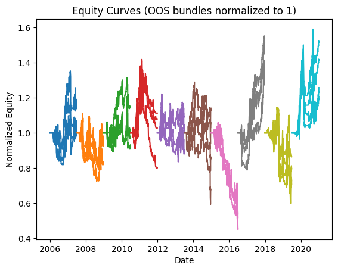
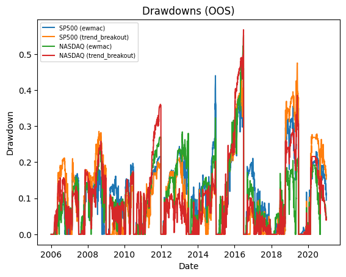

# Backtest Summary: `18:47 14.08.2025`

**Run date:** 2025-08-14 18:51

**Contents:**

- [1. Combined Statistics](#1-combined-statistics)

- [2. Per-Asset Permutation Tests](#2-per-asset-permutation-tests)

- [3. Multiple-System Selection Bias](#3-multiple-system-selection-bias)

- [4. Key Charts](#4-key-charts)

- [5. Correlation Analysis](#5-correlation-analysis)

## 1. Combined Statistics

| Instrument | cagr | cagr_geom | annualised_return_log | total_return | annual_vol | sharpe | sortino | skew | max_drawdown | avg_drawdown | avg_dd_duration | profit_factor | expectancy | std_daily | 5th pctile | 95th pctile | avg_win | avg_loss | max_loss_pct | avg_30d_ret | avg_30d_ret_plus_2std | avg_30d_ret_minus_2std | avg_30d_ret_ci_low | avg_30d_ret_ci_high | cagr_equity | mean_annual_return | expectancy_usd | expectancy_pct | win_rate | Cost %/Trade | cost_sharp |
| --- | --- | --- | --- | --- | --- | --- | --- | --- | --- | --- | --- | --- | --- | --- | --- | --- | --- | --- | --- | --- | --- | --- | --- | --- | --- | --- | --- | --- | --- | --- | --- |
| SP500 (ewmac) | -4.7% | -0.0465222388390505 | -0.0466598813986584 | 0.2576855519609375 | 27.2% | -0.04 | -0.04 | -1.6303466609232105 | 61.9% | 28.5% | 32.76 | 0.82 | -174.89 | 0.02 | -2.6% | 2.6% | 1.0% | -1.1% | -18.6% | -0.0012449345230392 | 0.1552169740286222 | -0.1577068430747008 | -0.015519494832382 | 0.0130296257863035 | 0.0154129194758306 | -0.0137943968584707 | -174.8877762204488 | -0.0072126355951042 | 20.8% | 0.2% | 0.1675905426716007 |
| **SP500 (trend_breakout)** | -1.5% | -0.0152610878497266 | -0.0153069802642709 | 0.2053477560781251 | 24.3% | 0.06 | 0.06 | -2.000093641831342 | 61.3% | 23.6% | 21.85496183206107 | 1.11 | 125.90 | 0.02 | -2.4% | 2.2% | 1.0% | -1.1% | -20.5% | 0.0019490929757374 | 0.1472853391355965 | -0.1433871531841217 | -0.0113099388595061 | 0.0152081248109809 | 0.0125376821005976 | 0.0119951893361612 | 125.90023671796276 | 0.0031286582265183 | 35.5% | 0.2% | 0.0978193371473209 |
| NASDAQ (ewmac) | -2.5% | -0.0252354026149306 | -0.0253109015344923 | 0.5229348977773438 | 24.7% | 0.02 | 0.02 | -1.1206799425639349 | 67.6% | 23.5% | 29.3302752293578 | 1.03 | 25.82 | 0.02 | -2.5% | 2.3% | 1.0% | -1.1% | -14.9% | 0.0008489502974181 | 0.1448800019901249 | -0.1431821013952887 | -0.0122922159317744 | 0.0139901165266106 | 0.0284592711383171 | 0.0026288530047349 | 25.821006502432112 | -0.0022138343898645 | 26.4% | 0.1% | 0.0886115769712634 |
| NASDAQ (trend_breakout) | -1.9% | -0.0190534522141355 | -0.0191106377580675 | 0.4168710215429687 | 23.2% | 0.03 | 0.04 | -1.142798783498687 | 64.9% | 18.9% | 26.62608695652174 | 1.11 | 91.03 | 0.01 | -2.4% | 2.3% | 1.0% | -1.1% | -14.2% | 0.0012762394170053 | 0.1437280185038388 | -0.141175539669828 | -0.011716653208006 | 0.0142691320420168 | 0.0235182667450112 | 0.0089934296199471 | 91.03013349374616 | 0.0003594993450656 | 28.8% | 0.1% | 0.0685571644370953 |
| Portfolio | 0.1% | 0.0010663278528082 | 0.0010670097427066 | 0.0161037436597908 | 26.8% | 0.14 | 0.15 | -1.766287290304008 | 76.1% | 28.9% | 168.36363636363637 | 1.00 | 0.47 | 0.02 | -2.5% | 2.5% | 1.0% | -1.1% | -23.5% | 0.0033258309609471 | 0.1762131472058868 | -0.1695614852839926 | -0.0118631372339597 | 0.0185147991558539 | 0.0010663278528082 | 0.0726040712087037 | 146.397669634457 | 0.0672136632949736 | 52.2% | N/A | nan |

## 2. Per-Asset Permutation Tests

| Instrument            | Test 1 p   | Test 2 p   | Trend   | Bias   | Skill   |
|:----------------------|:-----------|:-----------|:--------|:-------|:--------|
| SP500-ewmac           | N/A        | N/A        | N/A     | N/A    | N/A     |
| SP500-trend_breakout  | N/A        | N/A        | N/A     | N/A    | N/A     |
| NASDAQ-ewmac          | N/A        | N/A        | N/A     | N/A    | N/A     |
| NASDAQ-trend_breakout | N/A        | N/A        | N/A     | N/A    | N/A     |

## 4. Key Charts

### Equity Curves

### Drawdowns

### 30-Bar Return Dist.

## 5. Correlation Analysis

### Strategy Return Correlation

| index          |   ewmac |   trend_breakout |
|:---------------|--------:|-----------------:|
| ewmac          |    1.00 |             0.83 |
| trend_breakout |    0.83 |             1.00 |

### Asset Return Correlation

| index                   |   SP500 (ewmac) |   SP500 (trend_breakout) |   NASDAQ (ewmac) |   NASDAQ (trend_breakout) |
|:------------------------|----------------:|-------------------------:|-----------------:|--------------------------:|
| SP500 (ewmac)           |            1.00 |                     0.80 |             0.86 |                      0.72 |
| SP500 (trend_breakout)  |            0.80 |                     1.00 |             0.69 |                      0.82 |
| NASDAQ (ewmac)          |            0.86 |                     0.69 |             1.00 |                      0.83 |
| NASDAQ (trend_breakout) |            0.72 |                     0.82 |             0.83 |                      1.00 |

