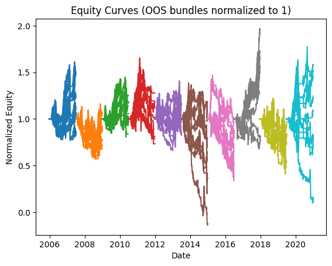
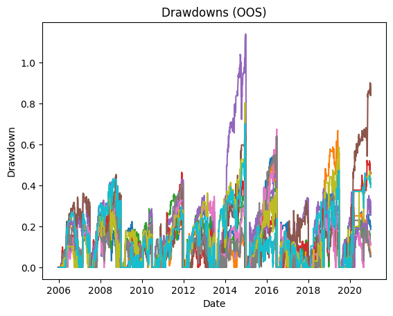

# Backtest Summary: `19:02 11.08.2025`

**Run date:** 2025-08-11 19:02

**Contents:**

- [1. Combined Statistics](#1-combined-statistics)

- [2. Per-Asset Permutation Tests](#2-per-asset-permutation-tests)

- [3. Multiple-System Selection Bias](#3-multiple-system-selection-bias)

- [4. Key Charts](#4-key-charts)

- [5. Correlation Analysis](#5-correlation-analysis)

## 1. Combined Statistics

| Instrument | cagr | total_return | mean_annual_return | annualised_return_log | annual_vol | sharpe | sortino | skew | max_drawdown | avg_drawdown | avg_dd_duration | profit_factor | expectancy | win_rate | std_daily | 5th pctile | 95th pctile | avg_win | avg_loss | max_loss_pct | avg_30d_ret | avg_30d_ret_plus_2std | avg_30d_ret_minus_2std | avg_30d_ret_ci_low | avg_30d_ret_ci_high | Cost %/Trade | cost_sharp |
| --- | --- | --- | --- | --- | --- | --- | --- | --- | --- | --- | --- | --- | --- | --- | --- | --- | --- | --- | --- | --- | --- | --- | --- | --- | --- | --- | --- |
| SP500 (ewmac) | -5.4% | 0.2450795603759765 | 0.0026738089204641 | -0.0541770686529809 | 35.2% | 0.02 | 0.02 | -1.6937144539400413 | 64.2% | 15.3% | 30.07547169811321 | 0.95 | -24.18 | 30.4% | 0.02 | -3.1% | 3.3% | 1.5% | -1.6% | -27.9% | 0.0011371780051992 | 0.1987724341637164 | -0.1964980781533178 | -0.0169005951343007 | 0.0191749511446993 | 0.3% | 0.0482527863729798 |
| SP500 (trend_breakout) | -1.0% | 0.4682649207031248 | 0.0407424742735612 | -0.0102675315020133 | 31.9% | 0.13 | 0.12 | -2.1109400591581062 | 66.8% | 16.0% | 20.78102189781022 | 1.35 | 201.21 | 34.4% | 0.02 | -3.0% | 2.9% | 1.5% | -1.6% | -28.9% | 0.0050767682828186 | 0.1955330809661556 | -0.1853795444005184 | -0.0122915009474062 | 0.0224450375130434 | 0.3% | 0.0276081072551575 |
| **DAX (ewmac)** | 0.4% | 0.0866417675911195 | 0.0222109435592535 | 0.0039090915341882 | 30.7% | 0.17 | 0.19 | -0.0731441107045742 | 42.0% | 14.7% | 29.818181818181817 | 1.13 | 53.33 | 32.8% | 0.02 | -3.0% | 3.0% | 1.5% | -1.5% | -15.6% | 0.0052215558300908 | 0.1844294517940279 | -0.1739863401338461 | -0.0110585847165417 | 0.0215016963767235 | 0.1% | 0.0330677207731464 |
| DAX (trend_breakout) | -3.0% | -0.3135298706505733 | -0.0036436395979293 | -0.0298310720924456 | 27.5% | 0.03 | 0.03 | -0.5725410711255006 | 52.1% | 16.1% | 24.912 | 0.92 | -26.92 | 31.2% | 0.02 | -2.8% | 2.7% | 1.4% | -1.4% | -14.6% | 0.0009114360602281 | 0.1747755403524542 | -0.1729526682319979 | -0.0148679786766977 | 0.016690850797154 | 0.1% | 0.0354091044249705 |
| FTSE (ewmac) | -16.4% | -0.2408582371209299 | -0.2118686338725884 | -0.1637090355114895 | 1354.0% | 0.13 | 0.19 | 34.85846304883537 | 113.9% | 23.5% | 53.857142857142854 | 0.34 | -396.30 | 20.5% | 0.85 | -4.3% | 3.7% | 6.5% | -4.3% | -2194.8% | -0.0313868357173053 | 1.6572796471345796 | -1.7200533185691902 | -0.1852365371576129 | 0.1224628657230022 | 0.1% | -0.3777489441957188 |
| FTSE (trend_breakout) | -24.0% | -0.8958346157505639 | -0.159040225310073 | -0.239695113769441 | 37.7% | -0.53 | -0.53 | -0.9816328290355684 | 90.1% | 21.6% | 41.436619718309856 | 0.22 | -652.62 | 17.6% | 0.02 | -3.6% | 3.1% | 1.6% | -1.9% | -33.3% | -0.0254551227402091 | 0.1857817938170247 | -0.2366920392974431 | -0.0441352174912508 | -0.0067750279891674 | 0.1% | 0.0226224617478892 |
| NASDAQ (ewmac) | -5.2% | 0.5823345366015624 | -0.0071588584314679 | -0.0518505260493908 | 31.4% | -0.01 | -0.01 | -1.173022495965903 | 67.4% | 14.7% | 28.918181818181814 | 0.97 | -15.30 | 28.0% | 0.02 | -3.1% | 2.9% | 1.3% | -1.5% | -18.6% | -0.0004354322693509 | 0.1808526045494116 | -0.1817234690881135 | -0.0169736941402601 | 0.0161028296015582 | 0.1% | 0.093010086490996 |
| NASDAQ (trend_breakout) | -2.5% | 0.5191876373437501 | 0.014572602458288 | -0.024797683182903 | 29.5% | 0.06 | 0.07 | -1.2025599408769527 | 63.9% | 14.6% | 27.357142857142858 | 1.15 | 61.75 | 30.0% | 0.02 | -3.0% | 2.8% | 1.3% | -1.4% | -19.2% | 0.002710086103457 | 0.1802698209730731 | -0.1748496487661591 | -0.0134795523895003 | 0.0188997245964143 | 0.1% | 0.0676217335336176 |
| DJ30 (ewmac) | -6.6% | -0.26100863421875 | 0.0047660029994005 | -0.0663804977390132 | 39.5% | 0.03 | 0.02 | 0.1790315234651412 | 80.3% | 18.6% | 28.18918918918919 | 1.01 | 6.30 | 20.4% | 0.02 | -3.5% | 3.4% | 1.8% | -2.0% | -32.7% | -0.001012514113069 | 0.2172715388201982 | -0.2192965670463363 | -0.020938732924864 | 0.0189137046987259 | 0.0% | 0.0309419594144157 |
| DJ30 (trend_breakout) | -5.6% | -0.1708224223437501 | 0.006581992654873 | -0.0561887836956823 | 34.1% | 0.00 | 0.00 | -0.9865336259982014 | 70.1% | 18.6% | 28.38532110091743 | 1.00 | 0.64 | 23.5% | 0.02 | -3.5% | 3.2% | 1.7% | -1.8% | -20.8% | 0.0002887947305098 | 0.2118508172349158 | -0.211273227773896 | -0.019022712466491 | 0.0196003019275108 | 0.0% | 0.0339103081370692 |
| Portfolio | -3.5% | -0.4175822737694172 | 0.044636707241296 | -0.0353244771698921 | 29.1% | 0.03 | 0.03 | -0.9505482960254352 | 82.7% | 36.3% | 102.05405405405403 | 0.98 | -11.33 | 52.2% | 0.02 | -2.8% | 2.7% | 1.1% | -1.2% | -20.1% | -0.0005348826073886 | 0.1863905591869559 | -0.1874603244017332 | -0.016732989482424 | 0.0156632242676467 | N/A | nan |

## 2. Per-Asset Permutation Tests

| Instrument            | Test 1 p   | Test 2 p   | Trend   | Bias   | Skill   |
|:----------------------|:-----------|:-----------|:--------|:-------|:--------|
| SP500-ewmac           | N/A        | N/A        | N/A     | N/A    | N/A     |
| SP500-trend_breakout  | N/A        | N/A        | N/A     | N/A    | N/A     |
| DAX-ewmac             | N/A        | N/A        | N/A     | N/A    | N/A     |
| DAX-trend_breakout    | N/A        | N/A        | N/A     | N/A    | N/A     |
| FTSE-ewmac            | N/A        | N/A        | N/A     | N/A    | N/A     |
| FTSE-trend_breakout   | N/A        | N/A        | N/A     | N/A    | N/A     |
| NASDAQ-ewmac          | N/A        | N/A        | N/A     | N/A    | N/A     |
| NASDAQ-trend_breakout | N/A        | N/A        | N/A     | N/A    | N/A     |
| DJ30-ewmac            | N/A        | N/A        | N/A     | N/A    | N/A     |
| DJ30-trend_breakout   | N/A        | N/A        | N/A     | N/A    | N/A     |

## 4. Key Charts

### Equity Curves

### Drawdowns

### 30-Bar Return Dist.

## 5. Correlation Analysis

### Strategy Return Correlation

| index          |   trend_breakout |   ewmac |
|:---------------|-----------------:|--------:|
| trend_breakout |             1.00 |    0.08 |
| ewmac          |             0.08 |    1.00 |

### Asset Return Correlation

| index                   |   SP500 (ewmac) |   SP500 (trend_breakout) |   DAX (ewmac) |   DAX (trend_breakout) |   FTSE (ewmac) |   FTSE (trend_breakout) |   NASDAQ (ewmac) |   NASDAQ (trend_breakout) |   DJ30 (ewmac) |   DJ30 (trend_breakout) |
|:------------------------|----------------:|-------------------------:|--------------:|-----------------------:|---------------:|------------------------:|-----------------:|--------------------------:|---------------:|------------------------:|
| SP500 (ewmac)           |            1.00 |                     0.77 |          0.40 |                   0.39 |           0.01 |                    0.30 |             0.85 |                      0.70 |           0.83 |                    0.77 |
| SP500 (trend_breakout)  |            0.77 |                     1.00 |          0.31 |                   0.34 |           0.02 |                    0.30 |             0.68 |                      0.80 |           0.65 |                    0.69 |
| DAX (ewmac)             |            0.40 |                     0.31 |          1.00 |                   0.80 |           0.02 |                    0.46 |             0.39 |                      0.31 |           0.33 |                    0.35 |
| DAX (trend_breakout)    |            0.39 |                     0.34 |          0.80 |                   1.00 |          -0.00 |                    0.42 |             0.37 |                      0.30 |           0.35 |                    0.39 |
| FTSE (ewmac)            |            0.01 |                     0.02 |          0.02 |                  -0.00 |           1.00 |                   -0.01 |             0.00 |                      0.01 |           0.01 |                    0.02 |
| FTSE (trend_breakout)   |            0.30 |                     0.30 |          0.46 |                   0.42 |          -0.01 |                    1.00 |             0.26 |                      0.24 |           0.27 |                    0.32 |
| NASDAQ (ewmac)          |            0.85 |                     0.68 |          0.39 |                   0.37 |           0.00 |                    0.26 |             1.00 |                      0.81 |           0.67 |                    0.63 |
| NASDAQ (trend_breakout) |            0.70 |                     0.80 |          0.31 |                   0.30 |           0.01 |                    0.24 |             0.81 |                      1.00 |           0.53 |                    0.54 |
| DJ30 (ewmac)            |            0.83 |                     0.65 |          0.33 |                   0.35 |           0.01 |                    0.27 |             0.67 |                      0.53 |           1.00 |                    0.84 |
| DJ30 (trend_breakout)   |            0.77 |                     0.69 |          0.35 |                   0.39 |           0.02 |                    0.32 |             0.63 |                      0.54 |           0.84 |                    1.00 |

