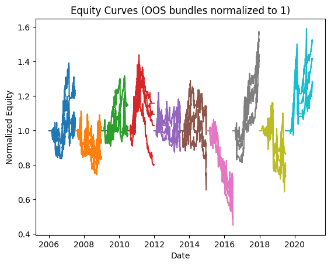
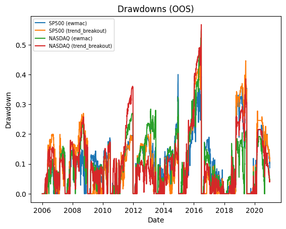
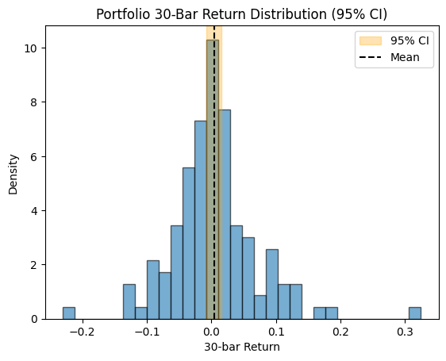

# Backtest Summary: `19:06 11.08.2025`

**Run date:** 2025-08-11 19:06

**Contents:**

- [1. Combined Statistics](#1-combined-statistics)

- [2. Per-Asset Permutation Tests](#2-per-asset-permutation-tests)

- [3. Multiple-System Selection Bias](#3-multiple-system-selection-bias)

- [4. Key Charts](#4-key-charts)

- [5. Correlation Analysis](#5-correlation-analysis)

## 1. Combined Statistics

| Instrument | cagr | total_return | mean_annual_return | annualised_return_log | annual_vol | sharpe | sortino | skew | max_drawdown | avg_drawdown | avg_dd_duration | profit_factor | expectancy | win_rate | std_daily | 5th pctile | 95th pctile | avg_win | avg_loss | max_loss_pct | avg_30d_ret | avg_30d_ret_plus_2std | avg_30d_ret_minus_2std | avg_30d_ret_ci_low | avg_30d_ret_ci_high | Cost %/Trade | cost_sharp |
| --- | --- | --- | --- | --- | --- | --- | --- | --- | --- | --- | --- | --- | --- | --- | --- | --- | --- | --- | --- | --- | --- | --- | --- | --- | --- | --- | --- |
| SP500 (ewmac) | -1.0% | 0.2842469085839842 | 0.0198251101277253 | -0.0100086154219839 | 26.3% | 0.10 | 0.10 | -1.5271780357330296 | 40.0% | 11.8% | 29.23636363636364 | 1.11 | 94.28 | 23.4% | 0.02 | -2.5% | 2.5% | 1.1% | -1.1% | -18.8% | 0.0029886982491804 | 0.1570650459263842 | -0.1510876494280232 | -0.0110672510451602 | 0.0170446475435212 | 0.3% | 0.0477116456566768 |
| **SP500 (trend_breakout)** | -0.1% | 0.2784110819140624 | 0.0277870837946031 | -0.0007413852584284 | 24.0% | 0.12 | 0.12 | -1.9710583058525544 | 53.7% | 13.1% | 21.118518518518517 | 1.31 | 342.44 | 33.3% | 0.02 | -2.3% | 2.2% | 1.1% | -1.1% | -20.1% | 0.0038111636059826 | 0.1460945534540924 | -0.1384722262421272 | -0.0091718539520743 | 0.0167941811640395 | 0.3% | 0.0276563500400558 |
| NASDAQ (ewmac) | -2.5% | 0.5229348977773438 | 0.0026288530047349 | -0.0252117383817642 | 24.7% | 0.02 | 0.02 | -1.1206799425639349 | 55.2% | 11.9% | 29.3302752293578 | 1.03 | 25.82 | 26.4% | 0.02 | -2.5% | 2.3% | 1.0% | -1.1% | -14.9% | 0.0008489502974181 | 0.1448800019901249 | -0.1431821013952887 | -0.0122922159317744 | 0.0139901165266106 | 0.1% | 0.0886115769712634 |
| NASDAQ (trend_breakout) | -1.9% | 0.4168710215429687 | 0.0089934296199471 | -0.019035528314994 | 23.2% | 0.03 | 0.04 | -1.142798783498687 | 56.7% | 12.2% | 26.62608695652174 | 1.11 | 91.03 | 28.8% | 0.01 | -2.4% | 2.3% | 1.0% | -1.1% | -14.2% | 0.0012762394170053 | 0.1437280185038388 | -0.141175539669828 | -0.011716653208006 | 0.0142691320420168 | 0.1% | 0.0685571644370953 |
| Portfolio | 1.3% | 0.2080630398436274 | 0.0573202712856056 | 0.0126978509484245 | 23.2% | 0.17 | 0.18 | -1.5057908305832857 | 67.3% | 24.3% | 142.23076923076923 | 1.01 | 6.14 | 52.9% | 0.01 | -2.3% | 2.2% | 0.9% | -1.0% | -17.5% | 0.0037611565534681 | 0.1495455616027953 | -0.1420232484958591 | -0.0090469798525518 | 0.016569292959488 | N/A | nan |

## 2. Per-Asset Permutation Tests

| Instrument            | Test 1 p   | Test 2 p   | Trend   | Bias   | Skill   |
|:----------------------|:-----------|:-----------|:--------|:-------|:--------|
| SP500-ewmac           | N/A        | N/A        | N/A     | N/A    | N/A     |
| SP500-trend_breakout  | N/A        | N/A        | N/A     | N/A    | N/A     |
| NASDAQ-ewmac          | N/A        | N/A        | N/A     | N/A    | N/A     |
| NASDAQ-trend_breakout | N/A        | N/A        | N/A     | N/A    | N/A     |

## 4. Key Charts

### Equity Curves

### Drawdowns

### 30-Bar Return Dist.

## 5. Correlation Analysis

### Strategy Return Correlation

| index          |   trend_breakout |   ewmac |
|:---------------|-----------------:|--------:|
| trend_breakout |             1.00 |    0.83 |
| ewmac          |             0.83 |    1.00 |

### Asset Return Correlation

| index                   |   SP500 (ewmac) |   SP500 (trend_breakout) |   NASDAQ (ewmac) |   NASDAQ (trend_breakout) |
|:------------------------|----------------:|-------------------------:|-----------------:|--------------------------:|
| SP500 (ewmac)           |            1.00 |                     0.80 |             0.86 |                      0.72 |
| SP500 (trend_breakout)  |            0.80 |                     1.00 |             0.69 |                      0.82 |
| NASDAQ (ewmac)          |            0.86 |                     0.69 |             1.00 |                      0.83 |
| NASDAQ (trend_breakout) |            0.72 |                     0.82 |             0.83 |                      1.00 |

