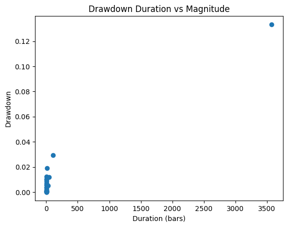

# Backtest Summary: `14:20 14.07.2025 (ewmac)`

**Run date:** 2025-07-14 14:20

**Strategy:** `ewmac.ewmac`

## 2. Combined Statistics

| cagr | annual_vol | sharpe | sortino | max_drawdown | avg_drawdown | avg_dd_duration | pf | expectancy | win_rate | std_daily | ret_5pct | ret_95pct |
| --- | --- | --- | --- | --- | --- | --- | --- | --- | --- | --- | --- | --- |
| 0.0061020362000168 | 0.0576850364436571 | 0.1344123694008584 | 0.1349546865796322 | 0.1028436932965237 | 0.0293854902181492 | 26.875968992248065 | 1.0596642831652383 | 24.541365378904135 | 3.29004329004329 | 0.0036338157333241 | -0.0053580641098924 | 0.0057464498530118 |
| 0.0051969215709679 | 0.0389829947101065 | 0.1524734314947311 | 0.0711320032172595 | 0.1117564368760808 | 0.0357764151123459 | 28.0625 | 1.343604984520996 | 471.1955781565021 | 8.387096774193548 | 0.0024556978419878 | -0.000710729470199 | 0.0016838832067436 |
| -0.0002122351467076 | 0.050208659581343 | 0.0210781999554781 | 0.0185672980387222 | 0.133328975642958 | 0.071478806875293 | 166.2173913043478 | nan | 4.454903406048892 | 0.5206273440163655 | 0.0031628482598603 | nan | nan |

## 3. Advanced Portfolio Statistical Tests

#### 3.1 Actual Metrics

| Metric | Value |
| --- | --- |
| actual_mean | 5.42511218491612e-06 |
| actual_log_pf | 0.0061249342496436 |
| actual_drawdown | 0.1333289756429595 |
| num_nonzero_rets | 3002.0 |

#### 3.2 Bootstrap Quantiles

| Quantile | Value |
| --- | --- |
| bs_mean_0.1% | -0.0002478770086103 |
| bs_log_pf_0.1% | -0.2663890981462136 |
| bs_dd_0.1% | 0.0678086314739446 |
| bs_mean_1.0% | -0.0001518999358874 |
| bs_log_pf_1.0% | -0.1698035326771984 |
| bs_dd_1.0% | 0.0827132160225098 |
| bs_mean_5.0% | -9.64341170799363e-05 |
| bs_log_pf_5.0% | -0.1092060010341954 |
| bs_dd_5.0% | 0.1038497250153051 |
| bs_mean_10.0% | -7.727025445413127e-05 |
| bs_log_pf_10.0% | -0.0864366551906224 |
| bs_dd_10.0% | 0.1180291730544179 |
| bs_mean_90.0% | 9.671398991182594e-05 |
| bs_log_pf_90.0% | 0.1104374397243631 |
| bs_dd_90.0% | 0.3104840119663188 |
| bs_mean_95.0% | 0.0001133191648401 |
| bs_log_pf_95.0% | 0.1300172774676934 |
| bs_dd_95.0% | 0.3544789380001657 |
| bs_mean_99.0% | 0.0001565060057276 |
| bs_log_pf_99.0% | 0.1795182128405403 |
| bs_dd_99.0% | 0.4214973914817548 |

#### 3.3 Permutation DD & p-value

| Quantile/Metric | Value |
| --- | --- |
| perm_dd_0.1% | 0.1030991248256617 |
| perm_dd_1.0% | 0.1165691236897777 |
| perm_dd_5.0% | 0.1324054811745206 |
| perm_dd_10.0% | 0.1438804805537225 |
| perm_dd_90.0% | 0.2545569763511808 |
| perm_dd_95.0% | 0.2730768708943801 |
| perm_dd_99.0% | 0.3095817823537358 |
| p_one_sided_drawdown | 0.053 |

## 4. Key Charts

### Portfolio Equity

### 30-Bar Return Distribution

### Drawdown Distribution

### Drawdown Duration vs Magnitude

