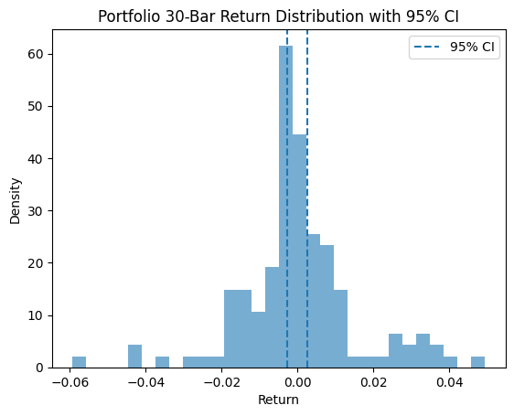

# Backtest Summary: `14:36 14.07.2025 (ewmac)`

**Run date:** 2025-07-14 14:37

**Strategy:** `ewmac.ewmac`

## 2. Combined Statistics

| Instrument | cagr | sharpe | max_drawdown | win_rate | expectancy | annual_vol | std_daily | ret_5pct | ret_95pct |
| --- | --- | --- | --- | --- | --- | --- | --- | --- | --- |
| SP500 | 0.61% | 0.13 | 10.28% | 329.00% | 24.54 | 5.77% | 0.00 | -0.54% | 0.57% |
| **DAX** | 0.52% | 0.15 | 11.18% | 838.71% | 471.20 | 3.90% | 0.00 | -0.07% | 0.17% |
| Portfolio | -0.02% | 0.02 | 13.33% | 52.06% | 4.45 | 5.02% | 0.00 | N/A | N/A |

## 3. Advanced Portfolio Statistical Tests

### 3.1 Actual Metrics

| Metric | Value |
| --- | --- |
| Mean (%) | 0.00% |
| Log PF | 0.01 |
| Drawdown (%) | 13.33% |
| Non-zero Bars | 3002 |

### 3.2 Bootstrap Quantiles

| mean_0.1% | log_pf_0.1% | dd_0.1% | mean_1.0% | log_pf_1.0% | dd_1.0% | mean_5.0% | log_pf_5.0% | dd_5.0% | mean_10.0% | log_pf_10.0% | dd_10.0% | mean_90.0% | log_pf_90.0% | dd_90.0% | mean_95.0% | log_pf_95.0% | dd_95.0% | mean_99.0% | log_pf_99.0% | dd_99.0% |
| --- | --- | --- | --- | --- | --- | --- | --- | --- | --- | --- | --- | --- | --- | --- | --- | --- | --- | --- | --- | --- |
| -0.0002264090952977 | -0.2461104886640304 | 0.0640210543347287 | -0.0001376669528223 | -0.1523906708172689 | 0.0789552916446366 | -0.0001024687469844 | -0.114812834065971 | 0.0999947612183491 | -8.203018710621466e-05 | -0.0923576133791412 | 0.1133052116223529 | 8.099390262297433e-05 | 0.0921322755659258 | 0.3218762013565237 | 0.000109894329999 | 0.1244350376710822 | 0.3507966148310198 | 0.0001550715077598 | 0.1771649423662882 | 0.4127181123580873 |
| -0.02% | -0.25 | 6.40% | -0.01% | -0.15 | 7.90% | -0.01% | -0.11 | 10.00% | -0.01% | -0.09 | 11.33% | 0.01% | 0.09 | 32.19% | 0.01% | 0.12 | 35.08% | 0.02% | 0.18 | 41.27% |

### 3.3 Permutation Drawdown Quantiles & P-Value

| 0.1% | 1.0% | 5.0% | 10.0% | 90.0% | 95.0% | 99.0% | p_one_sided_drawdown |
| --- | --- | --- | --- | --- | --- | --- | --- |
| 0.1054043660426422 | 0.1196386296915565 | 0.131248516431477 | 0.1427374644974755 | 0.2505810390152267 | 0.27137424861134 | 0.3062675344220528 | 0.06 |
| 10.54% | 11.96% | 13.12% | 14.27% | 25.06% | 27.14% | 30.63% | 0.060 |

## 4. Key Charts

### Portfolio Equity

### 30-Bar Return Dist.

### Drawdown Distribution

### DD Duration vs Magnitude

