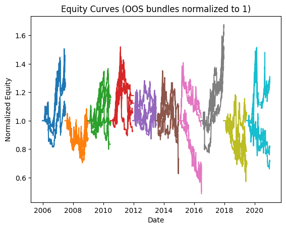
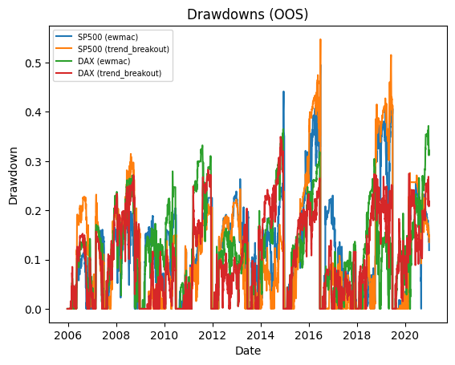
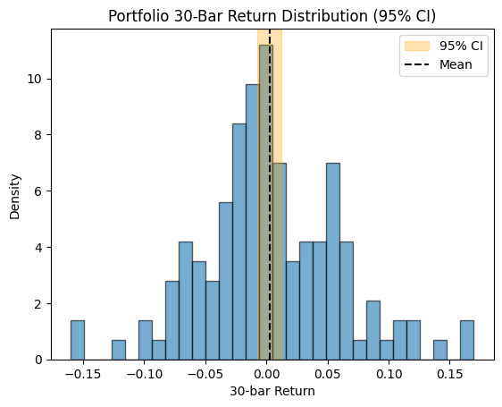

# Backtest Summary: `14:57 11.08.2025`

**Run date:** 2025-08-11 14:57

**Contents:**

- [1. Combined Statistics](#1-combined-statistics)

- [2. Per-Asset Permutation Tests](#2-per-asset-permutation-tests)

- [3. Multiple-System Selection Bias](#3-multiple-system-selection-bias)

- [4. Key Charts](#4-key-charts)

- [5. Correlation Analysis](#5-correlation-analysis)

## 1. Combined Statistics

| Instrument | cagr | total_return | mean_annual_return | annualised_return_log | annual_vol | sharpe | sortino | skew | max_drawdown | avg_drawdown | avg_dd_duration | profit_factor | expectancy | win_rate | std_daily | 5th pctile | 95th pctile | avg_win | avg_loss | max_loss_pct | avg_30d_ret | avg_30d_ret_plus_2std | avg_30d_ret_minus_2std | avg_30d_ret_ci_low | avg_30d_ret_ci_high | Cost %/Trade | cost_sharp |
| --- | --- | --- | --- | --- | --- | --- | --- | --- | --- | --- | --- | --- | --- | --- | --- | --- | --- | --- | --- | --- | --- | --- | --- | --- | --- | --- | --- |
| SP500 (ewmac) | -2.2% | 0.3046619070117187 | 0.0222869826492851 | -0.0215766325273955 | 31.1% | 0.09 | 0.09 | nan | 49.6% | 13.8% | 28.43362831858407 | 1.07 | 77.71 | 27.7% | 0.02 | -2.9% | 3.0% | 1.3% | -1.3% | -20.4% | 0.0034059224262564 | 0.1839177222543415 | -0.1771058774018286 | -0.0130640729797246 | 0.0198759178322376 | 0.2% | 0.0279006508476987 |
| SP500 (trend_breakout) | 0.7% | 0.3104087195800782 | 0.0420643921786648 | 0.0067867465750197 | 27.8% | 0.17 | 0.16 | nan | 54.8% | 14.6% | 20.759124087591243 | 1.41 | 486.04 | 32.3% | 0.02 | -2.7% | 2.6% | 1.2% | -1.3% | -23.4% | 0.0058275712369472 | 0.1709404881278849 | -0.1592853456539903 | -0.0092417206183331 | 0.0208968630922277 | 0.2% | 0.0158901597278471 |
| DAX (ewmac) | -0.7% | -0.2867935096885089 | 0.0075142287756557 | -0.0071133375761743 | 28.1% | 0.12 | 0.14 | nan | 37.2% | 13.7% | 28.81578947368421 | 1.06 | 48.73 | 28.3% | 0.02 | -2.8% | 2.7% | 1.3% | -1.2% | -13.8% | 0.0026972677362366 | 0.1677143493852309 | -0.1623198139127575 | -0.0122835046013552 | 0.0176780400738286 | 0.0% | 0.0214979424051182 |
| **DAX (trend_breakout)** | 2.1% | -0.1873911813968147 | 0.0333751076794729 | 0.020732007455996 | 24.7% | 0.21 | 0.24 | nan | 35.0% | 12.6% | 26.081967213114755 | 1.32 | 196.50 | 36.4% | 0.02 | -2.5% | 2.4% | 1.1% | -1.2% | -11.1% | 0.0057424500767031 | 0.1560603210379737 | -0.1445754208845674 | -0.0079060239279959 | 0.0193909240814022 | 0.0% | 0.0246356353939543 |
| Portfolio | 2.0% | 0.3461208288260924 | 0.0326203355791179 | 0.0199762640166983 | 17.5% | 0.20 | 0.22 | nan | 46.7% | 17.9% | 85.45454545454545 | 1.02 | 9.73 | 53.3% | 0.01 | -1.7% | 1.6% | 0.7% | -0.8% | -12.1% | 0.0034978971379232 | 0.1111071204805387 | -0.1041113262046922 | -0.0058333040592534 | 0.0128290983350998 | N/A | nan |

## 2. Per-Asset Permutation Tests

| Instrument           | Test 1 p   | Test 2 p   | Trend   | Bias   | Skill   |
|:---------------------|:-----------|:-----------|:--------|:-------|:--------|
| SP500-ewmac          | N/A        | N/A        | N/A     | N/A    | N/A     |
| SP500-trend_breakout | N/A        | N/A        | N/A     | N/A    | N/A     |
| DAX-ewmac            | N/A        | N/A        | N/A     | N/A    | N/A     |
| DAX-trend_breakout   | N/A        | N/A        | N/A     | N/A    | N/A     |

## 4. Key Charts

### Equity Curves

### Drawdowns

### 30-Bar Return Dist.

## 5. Correlation Analysis

### Strategy Return Correlation

| index          |   ewmac |   trend_breakout |
|:---------------|--------:|-----------------:|
| ewmac          |    1.00 |             0.87 |
| trend_breakout |    0.87 |             1.00 |

### Asset Return Correlation

| index                  |   SP500 (ewmac) |   SP500 (trend_breakout) |   DAX (ewmac) |   DAX (trend_breakout) |
|:-----------------------|----------------:|-------------------------:|--------------:|-----------------------:|
| SP500 (ewmac)          |            1.00 |                     0.80 |          0.42 |                   0.40 |
| SP500 (trend_breakout) |            0.80 |                     1.00 |          0.32 |                   0.30 |
| DAX (ewmac)            |            0.42 |                     0.32 |          1.00 |                   0.86 |
| DAX (trend_breakout)   |            0.40 |                     0.30 |          0.86 |                   1.00 |

