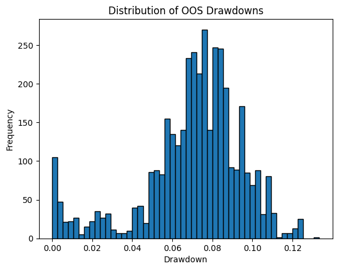

# Backtest Summary: `18:39 16.07.2025 (ewmac)`

**Run date:** 2025-07-16 18:46

**Strategy:** `ewmac.ewmac`

## 2. Combined Statistics

| Instrument | cagr | sharpe | max_drawdown | win_rate | expectancy | annual_vol | std_daily | ret_5pct | ret_95pct |
| --- | --- | --- | --- | --- | --- | --- | --- | --- | --- |
| SP500 | 0.61% | 0.13 | 10.28% | 329.00% | 24.54 | 5.77% | 0.00 | -0.54% | 0.57% |
| **DAX** | 0.52% | 0.15 | 11.18% | 838.71% | 471.20 | 3.90% | 0.00 | -0.07% | 0.17% |
| Portfolio | -0.02% | 0.02 | 13.33% | 52.06% | 4.45 | 5.02% | 0.00 | N/A | N/A |

## 4. Per-Asset Book-Style Permutation Tests

### SP500 – Test 1: OOS Bundle Permutation

| oos_bundle_p |
| --- |
| 0.81 |

### SP500 – Test 2: Training-Process Overfit

| training_overfit_p |
| --- |
| 0.0 |

### SP500 – Test 6: Partition Return (Trend/Bias/Skill)

| orig_return | trend | mean_bias | skill |
| --- | --- | --- | --- |
| -0.44 | 0.0 | -0.44 | -0.0 |

### DAX – Test 1: OOS Bundle Permutation

| oos_bundle_p |
| --- |
| 0.81 |

### DAX – Test 2: Training-Process Overfit

| training_overfit_p |
| --- |
| 0.0 |

### DAX – Test 6: Partition Return (Trend/Bias/Skill)

| orig_return | trend | mean_bias | skill |
| --- | --- | --- | --- |
| 1.01 | 0.0 | 1.01 | 0.0 |

## 5. Multiple-System Selection Bias

| solo_p | unbiased_p |
| --- | --- |
| 0.82 | 0.82 |
| 0.81 | 0.0 |

## 4. Key Charts

### Portfolio Equity

### 30-Bar Return Dist.

### Drawdown Distribution

### DD Duration vs Magnitude

