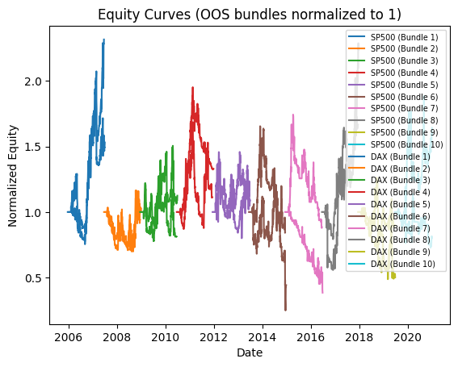
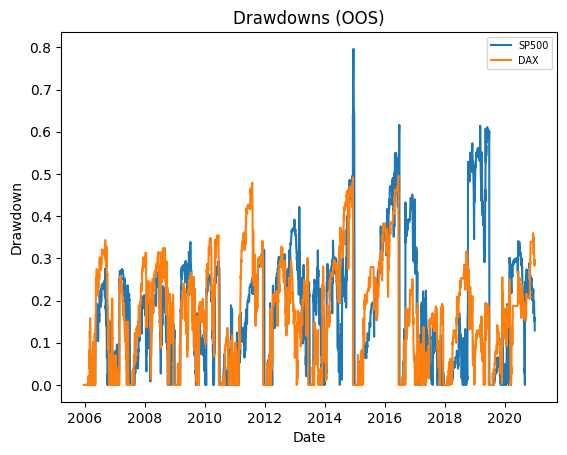
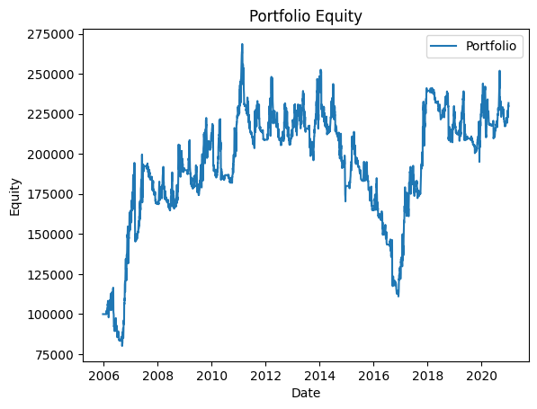
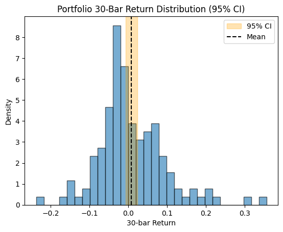
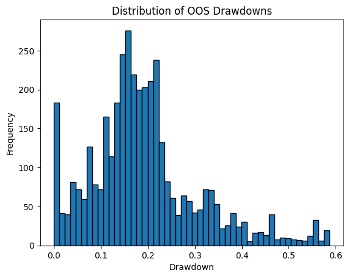
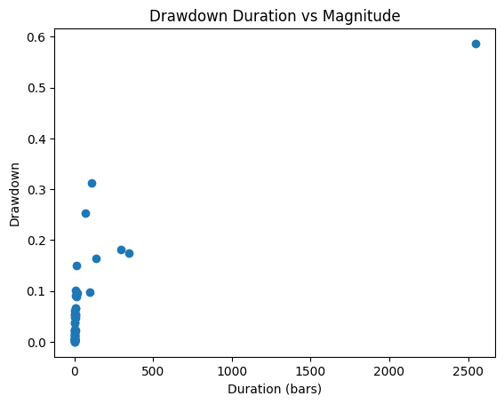

# Backtest Summary: `19:09 04.08.2025 (ewmac)`

**Run date:** 2025-08-04 19:09

**Strategy:** `ewmac.ewmac`

**Contents:**

- [1. Combined Statistics](#1-combined-statistics)

- [2. Per-Asset Permutation Tests](#2-per-asset-permutation-tests)

- [3. Multiple-System Selection Bias](#3-multiple-system-selection-bias)

- [4. Key Charts](#4-key-charts)

- [5. Correlation Analysis](#5-correlation-analysis)

## 1. Combined Statistics

| Instrument | cagr | annual_vol | sharpe | sortino | max_drawdown | avg_drawdown | avg_dd_duration | profit_factor | expectancy | win_rate | std_daily | 5th pctile | 95th pctile | avg_win | avg_loss | max_loss_pct | Cost %/Trade | Sharpe (no cost) |
| --- | --- | --- | --- | --- | --- | --- | --- | --- | --- | --- | --- | --- | --- | --- | --- | --- | --- | --- |
| SP500 | -1.5% | 55.5% | 0.26 | 0.28 | 79.6% | 20.5% | 29.22 | 1.04 | 31.02 | 78.3% | 0.03 | -5.0% | 5.3% | 2.2% | -2.2% | -40.2% | 0.2% | 0.30 |
| **DAX** | 4.2% | 44.6% | 0.32 | 0.38 | 49.6% | 19.4% | 26.69 | 1.05 | 122.01 | 207.0% | 0.03 | -4.4% | 4.4% | 2.1% | -2.0% | -22.3% | 0.1% | 0.34 |
| Portfolio | 5.6% | 24.7% | 0.35 | 0.39 | 58.7% | 19.8% | 79.83 | 1.04 | 37.72 | 52.2% | 0.02 | N/A | N/A | N/A | N/A | N/A | N/A | N/A |

## 2. Per-Asset Permutation Tests

| Instrument | Test 1 p | Test 2 p | Trend | Bias | Skill |
| --- | --- | --- | --- | --- | --- |
| SP500 | N/A | N/A | N/A | N/A | N/A |
| DAX | N/A | N/A | N/A | N/A | N/A |

## 4. Key Charts

### Equity Curves

### Drawdowns

### Portfolio Equity

### 30-Bar Return Dist.

### Drawdown Distribution

### DD Duration vs Magnitude

## 5. Correlation Analysis

### Asset Return Correlation

| index | SP500 | DAX |
| --- | --- | --- |
| SP500 | 1.0 | 0.42 |
| DAX | 0.42 | 1.0 |

