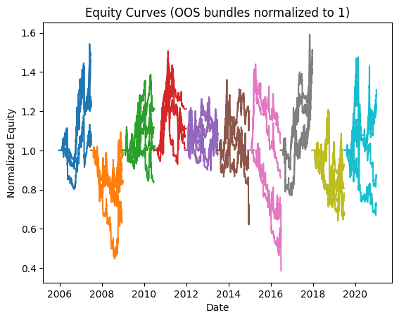
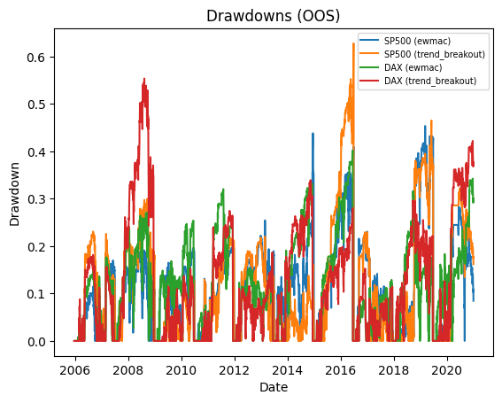
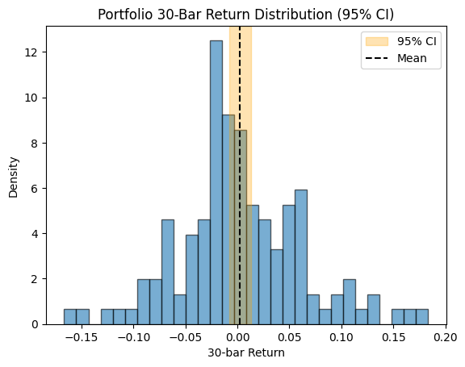

# Backtest Summary: `23:11 10.08.2025`

**Run date:** 2025-08-10 23:11

**Contents:**

- [1. Combined Statistics](#1-combined-statistics)

- [2. Per-Asset Permutation Tests](#2-per-asset-permutation-tests)

- [3. Multiple-System Selection Bias](#3-multiple-system-selection-bias)

- [4. Key Charts](#4-key-charts)

- [5. Correlation Analysis](#5-correlation-analysis)

## 1. Combined Statistics

| Instrument | cagr | annual_vol | sharpe | sortino | max_drawdown | avg_drawdown | avg_dd_duration | profit_factor | expectancy | win_rate | std_daily | 5th pctile | 95th pctile | avg_win | avg_loss | max_loss_pct | avg_30d_ret | avg_30d_ret_plus_2std | avg_30d_ret_minus_2std | avg_30d_ret_ci_low | avg_30d_ret_ci_high | Cost %/Trade | Sharpe (no cost) |
| --- | --- | --- | --- | --- | --- | --- | --- | --- | --- | --- | --- | --- | --- | --- | --- | --- | --- | --- | --- | --- | --- | --- | --- |
| SP500 (ewmac) | -1.4% | 30.8% | 0.11 | 0.12 | 45.4% | 13.5% | 30.735849056603772 | 1.11 | 95.16 | 24.5% | 0.02 | -2.9% | 3.0% | 1.3% | -1.3% | -23.8% | 0.0038759468851461 | 0.1862539314897784 | -0.178502037719486 | -0.0127584148242605 | 0.0205103085945529 | 0.2% | 0.15 |
| SP500 (trend_breakout) | -1.0% | 28.9% | 0.11 | 0.11 | 62.8% | 15.3% | 23.40650406504065 | 1.23 | 288.65 | 34.3% | 0.02 | -2.8% | 2.7% | 1.3% | -1.3% | -25.5% | 0.0042934351695759 | 0.1776108843758262 | -0.1690240140366743 | -0.0115186988954518 | 0.0201055692346037 | 0.2% | 0.14 |
| **DAX (ewmac)** | 0.2% | 28.5% | 0.15 | 0.18 | 40.2% | 14.1% | 28.448275862068964 | 1.11 | 79.43 | 25.3% | 0.02 | -2.8% | 2.6% | 1.3% | -1.2% | -13.6% | 0.0042636584003834 | 0.1765010921108253 | -0.1679737753100583 | -0.0113746930819463 | 0.0199020098827132 | 0.0% | 0.18 |
| DAX (trend_breakout) | -0.5% | 26.7% | 0.11 | 0.13 | 55.4% | 15.4% | 24.084615384615383 | 1.11 | 81.02 | 35.4% | 0.02 | -2.6% | 2.6% | 1.2% | -1.2% | -14.9% | 0.0033279355722902 | 0.1769134760345165 | -0.170257604889936 | -0.0124419088011018 | 0.0190977799456823 | 0.0% | 0.14 |
| Portfolio | 1.5% | 18.3% | 0.18 | 0.19 | 47.9% | 18.3% | 99.13157894736842 | 1.02 | 7.74 | 53.1% | 0.01 | -1.7% | 1.7% | 0.7% | -0.8% | -12.2% | 0.0031239255012312 | 0.1171741583028445 | -0.1109263073003822 | -0.0067633721598641 | 0.0130112231623265 | N/A | N/A |

## 2. Per-Asset Permutation Tests

| Instrument           | Test 1 p   | Test 2 p   | Trend   | Bias   | Skill   |
|:---------------------|:-----------|:-----------|:--------|:-------|:--------|
| SP500-ewmac          | N/A        | N/A        | N/A     | N/A    | N/A     |
| SP500-trend_breakout | N/A        | N/A        | N/A     | N/A    | N/A     |
| DAX-ewmac            | N/A        | N/A        | N/A     | N/A    | N/A     |
| DAX-trend_breakout   | N/A        | N/A        | N/A     | N/A    | N/A     |

## 4. Key Charts

### Equity Curves

### Drawdowns

### 30-Bar Return Dist.

## 5. Correlation Analysis

### Strategy Return Correlation

| index          |   trend_breakout |   ewmac |
|:---------------|-----------------:|--------:|
| trend_breakout |             1.00 |    0.84 |
| ewmac          |             0.84 |    1.00 |

### Asset Return Correlation

| index                  |   SP500 (ewmac) |   SP500 (trend_breakout) |   DAX (ewmac) |   DAX (trend_breakout) |
|:-----------------------|----------------:|-------------------------:|--------------:|-----------------------:|
| SP500 (ewmac)          |            1.00 |                     0.81 |          0.41 |                   0.41 |
| SP500 (trend_breakout) |            0.81 |                     1.00 |          0.30 |                   0.34 |
| DAX (ewmac)            |            0.41 |                     0.30 |          1.00 |                   0.80 |
| DAX (trend_breakout)   |            0.41 |                     0.34 |          0.80 |                   1.00 |

